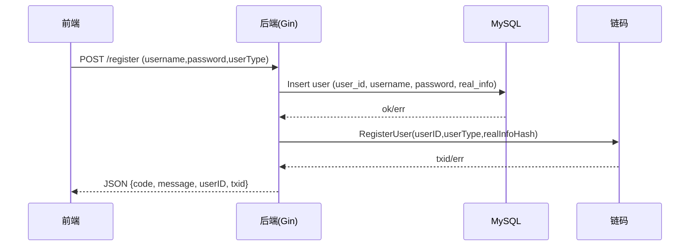
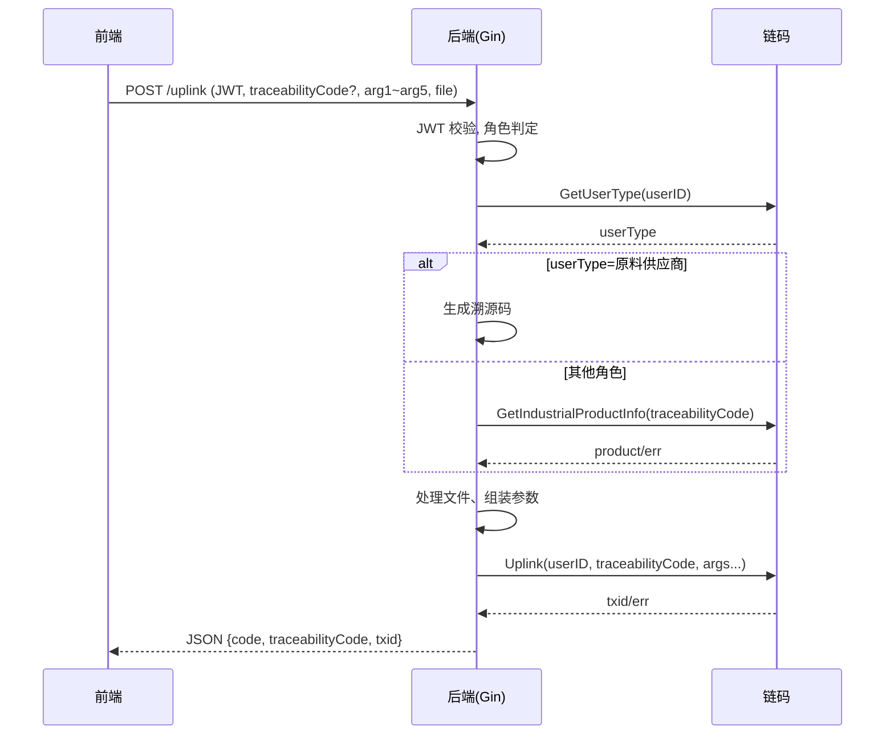
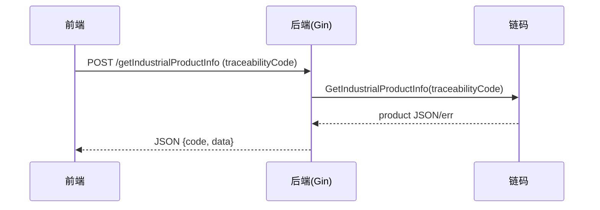

# Fabric Trace 详细设计文档

## 1. 项目概述
Fabric Trace 是一套基于 Hyperledger Fabric 的供应链溯源平台，支持原料供应商、制造商、物流承运商、经销商等多角色逐步写入并查询工业产品全生命周期数据。系统由 Vue.js 前端、Go (Gin) 后端、Fabric 链码与 MySQL 认证存储组成，兼顾链上不可篡改与链下便捷鉴权。

## 2. 整体架构
- 前端（application/web）：Vue + Element UI，负责页面展示、表单校验、鉴权路由守卫。
- 后端（application/backend）：Gin 提供 REST API，封装 JWT 鉴权、文件存储、与 Fabric SDK 的交互，并使用 MySQL 存储用户登录凭据。
- 区块链（blockchain/chaincode）：Go 链码定义核心业务模型与交易函数，数据持久化在 Fabric 账本（LevelDB/CouchDB）。
- 网络与部署：支持 Docker Compose 启动 Fabric 网络与后端；链码目录 `blockchain/chaincode`，网络脚本位于 `blockchain/network`。

数据流简述：
1) 用户注册：前端提交注册表单 → 后端写入 MySQL → 通过 Fabric SDK 调用链码 `RegisterUser` 写入链上用户信息。
2) 产品上链：携带 JWT 调用 `/uplink` → 后端校验用户类型与溯源码 → 封装参数调用链码 `Uplink`，链码根据用户类型填充对应环节字段。
3) 查询：前端调用查询接口 → 后端透传至链码 `GetIndustrialProductInfo`/`GetIndustrialProductHistory` 等，返回链上状态或历史记录。

## 3. 数据设计
### 3.1 链下 MySQL（用户认证）
表：`user`
- `user_id`：主键，雪花算法生成。
- `username`：唯一。
- `password`：加密存储。
- `real_info`：真实信息哈希（MD5）。

### 3.2 链上数据模型（`blockchain/chaincode/chaincode/model.go`）
```go
// 用户，含角色与产品列表
User {
  UserID string
  UserType string            // 原料供应商/制造商/物流承运商/经销商
  RealInfoHash string
  ProductList []*IndustrialProduct
}

// 工业产品，溯源码唯一标识
IndustrialProduct {
  TraceabilityCode string
  RawSupplierInput RawSupplierInput
  ManufacturerInput ManufacturerInput
  CarrierInput CarrierInput
  DealerInput DealerInput
}

// 历史查询结果
HistoryQueryResult { Record *IndustrialProduct; TxId string; Timestamp string; IsDelete bool }
```
各环节输入均含业务字段、图片名（链下存储文件名/哈希）、Txid、Timestamp。

## 4. 模块设计
### 4.1 用户模块（`controller/user.go`，`pkg/mysql.go`，`pkg/jwt.go`）
- 注册：生成雪花 `UserID`，写 MySQL，再调用链码 `RegisterUser(userID, userType, realInfoHash)`。
- 登录：查 MySQL 校验密码，链码查询 `GetUserType` 获取角色，生成 JWT（`GenToken`）。
- 登出：无状态，前端删除 JWT 即可。

### 4.2 溯源上链模块（`controller/trace.go`）
- 生成溯源码：原料供应商上链时由后端生成 18 位溯源码（雪花 ID 去头一位）。
- 参数校验：非原料供应商需提供已有溯源码并在链上校验存在。
- 文件处理：上传图片暂存 `files/uploadfiles/`，计算 SHA256+扩展名后存入 `files/images/`，删除原文件，链码字段保存文件名。
- 链码调用：`ChaincodeInvoke("Uplink", args)` 按用户角色填充不同业务字段。

### 4.3 查询模块（`controller/trace.go`）
- `GetIndustrialProductInfo`：按溯源码查当前状态。
- `GetIndustrialProductHistory`：按溯源码查历史变更。
- `GetIndustrialProductList`：按用户 ID 查关联产品列表。
- `GetAllIndustrialProductInfo`：查询全部产品（需鉴权）。

### 4.4 文件模块（`controller/file.go`，`pkg/storage`）
- 上传：鉴权后保存文件并返回文件 ID / 哈希。
- 下载：按文件 ID 读取本地存储。
- 图片访问：`/getImg/:filename` 直接静态返回。

### 4.5 中间件（`middleware/auth.go`）
- JWTAuthMiddleware：解析 JWT，写入上下文 `userID`，保护敏感路由。

## 5. 链码设计（`smartcontract.go`）
- `RegisterUser`：写入链上用户与角色。
- `Uplink`：按 `userType` 更新 `IndustrialProduct` 对应环节字段，记录 TxID 与时间戳（Asia/Shanghai）。首次由原料供应商创建产品并设置 `TraceabilityCode`。
- 查询类：`GetUserType`、`GetIndustrialProductInfo`、`GetIndustrialProductHistory`（迭代历史）、`GetIndustrialProductList`、`GetAllIndustrialProductInfo`。
- 辅助：`queryAllIndustrialProducts` 等遍历状态空间。

## 6. 接口设计（主要 REST API）
- POST `/register`：注册，参数 `username,password,userType`。
- POST `/login`：登录，返回 JWT。
- POST `/getInfo`：鉴权，返回用户类型与信息。
- POST `/uplink`：鉴权，上链。原料供应商无需 `traceabilityCode`，其余角色需提供。还需 `arg1`~`arg5` 与可选文件 `file`。
- POST `/getIndustrialProductInfo`：按溯源码查询。
- POST `/getIndustrialProductList`：鉴权，查用户关联列表。
- POST `/getAllIndustrialProductInfo`：鉴权，查全部。
- POST `/getIndustrialProductHistory`：鉴权，查历史。
- 文件相关：POST `/file/upload`，GET `/file/download/:fileID`，GET `/getImg/:filename`。

## 7. 部署与运行要点
- Fabric 网络：`blockchain/network` 提供脚本，先启动网络与通道，再部署链码（`trace.tar.gz`）。
- 后端：`application/backend`，需配置 `settings/config.yaml`/`config_docker.yaml` 中的 Fabric 连接、MySQL、存储路径；可通过 `start_docker.sh` 启动容器。
- 前端：`application/web`，`npm install && npm run serve`（开发）或 `npm run build` 生成静态文件，产物放入后端 `dist` 目录供 Gin 静态服务。

## 8. 安全与合规
- 鉴权：JWT 保护写操作与敏感读接口。
- 传输：建议在生产使用 HTTPS 与 Fabric TLS。
- 密码与哈希：链上仅存 `RealInfoHash`，链下密码应加盐存储（当前实现需确认加密强度）。
- 文件校验：图片以 SHA256 重命名，减少覆盖风险。
- 访问控制：Fabric 可通过 MSP / ACL 进一步细化（未来可扩展）。

## 9. 日志与错误处理
- 后端：Gin 默认日志，可按需接入集中日志；链码通过 `log` 输出，建议配合 Peer 日志采集。
- 错误返回：统一 JSON，`code` 与 `message` 字段，链码错误透传后端。

## 10. 性能与扩展
- 链码写操作受背书与提交耗时影响，批量上链可异步队列化（未来优化）。
- 静态文件可上云存储（如 OSS/S3）替代本地，链上仅存引用。
- 前端可引入分页/懒加载优化查询展示。

## 11. 未来工作
- 增加组织级权限与更细粒度角色。
- 对接对象存储与 CDN 提升文件访问性能。
- 完善监控（Prometheus/Grafana 已有目录可接入）。
- 增加自动化测试与 CI/CD（链码与后端）。

## 12. 流程图与时序图
### 12.1 注册时序（后端+链码）


### 12.2 产品上链（多角色）


### 12.3 产品查询


## 13. 接口参数与示例
> 仅列核心接口，所有请求均为 `application/x-www-form-urlencoded` 或 `multipart/form-data`（上传文件），返回 JSON。

### 13.1 POST `/register`
- 请求参数：
  - `username` (string, 必填)
  - `password` (string, 必填)
  - `userType` (string, 必填，如“原料供应商”/“制造商”/“物流承运商”/“经销商”)
- 成功响应示例：
```json
{ "code":200, "message":"register success", "txid":"<fabric-txid>", "userID":"<snowflake-id>" }
```
- 失败示例：
```json
{ "message":"register failed：duplicate username" }
```

### 13.2 POST `/login`
- 请求参数：`username`, `password`
- 成功响应：
```json
{ "code":200, "message":"login success", "jwt":"<token>" }
```

### 13.3 POST `/uplink`（需 JWT）
- Header: `Authorization: Bearer <jwt>`
- Content-Type: `multipart/form-data`（可含文件）
- 公共表单字段：`arg1`~`arg5`（随角色含义变化），可选 `file`
- 溯源码：
  - 原料供应商：不传 `traceabilityCode`
  - 其他角色：必须传已有 `traceabilityCode`
- 成功响应：
```json
{ "code":200, "message":"uplink success", "txid":"<fabric-txid>", "traceabilityCode":"<code>" }
```
- 校验失败：
```json
{ "message":"请检查溯源码是否正确!!" }
```

### 13.4 POST `/getIndustrialProductInfo`
- 参数：`traceabilityCode`
- 响应：
```json
{ "code":200, "message":"query success", "data": { "traceabilityCode":"...", "rawSupplierInput":{...}, "manufacturerInput":{...}, ... } }
```

### 13.5 POST `/getIndustrialProductHistory`
- 参数：`traceabilityCode`
- 响应（示例截断）：
```json
{ "code":200, "message":"query success", "data":[ {"record":{...}, "txId":"...", "timestamp":"...", "isDelete":false} ] }
```

### 13.6 POST `/getIndustrialProductList`（需 JWT）
- 无额外参数；从 JWT 解析 `userID`
- 响应：
```json
{ "code":200, "message":"query success", "data":["<traceabilityCode1>", "<traceabilityCode2>"] }
```

### 13.7 文件相关
- `POST /file/upload`（需 JWT，multipart）：返回上传后的文件标识/路径。
- `GET /file/download/:fileID`：下载文件。
- `GET /getImg/:filename`：直出图片流；不存在返回 404。

## 14. 备注
- 若生产环境需 ASCII 方案，可将 mermaid 图转为离线 PNG 并存放于 `docs/`，或使用基于 CI 的渲染。
- 接口示例基于当前代码返回格式，若后续添加 `code` 语义或错误码表，请同步此处。

## 0.1 这套系统由什么组成（通俗说明）
| 部分 | 主要作用 | 举例 | 为什么需要 |
|------|----------|------|------------|
| 前端网页（Vue） | 给人看的界面，填写表单、查看列表 | 管理后台、扫码查询页 | 直观、易操作，减少培训成本 |
| 后端服务（Go+Gin） | 接收请求、校验登录、处理文件、调用区块链 | 登录接口、上链接口 | 做“闸口”和“调度”，把数据送到正确的地方 |
| 区块链（Fabric 链码） | 保存溯源核心数据，防篡改、可追溯 | 记录溯源码下的每个环节信息 | 提供可信“电子档案柜” |
| MySQL | 存账号密码等登录信息 | 用户表 | 让登录认证更快更轻量 |
| 本地文件存储 | 存图片/附件，链上只存文件名/哈希 | 产品图片 | 避免大文件上链导致链慢、费用高 |
| JWT 鉴权 | 给用户发“通行证”，后续接口识别身份 | Authorization: Bearer <token> | 无状态、前后端分离好用 |

## 0.2 为什么用这些技术（白话版）
- Vue：组件化、生态成熟，做表单/表格快捷，用户体验好。
- Go + Gin：性能高、部署简单，接口开发轻量，且与区块链 SDK 对接成熟。
- Fabric（联盟链）：适合多企业/多角色协作，可控权限与隐私，成本可控，数据不可轻易篡改。
- MySQL：老牌关系库，查账号快、运维成熟，把鉴权放在链下减轻区块链压力。
- JWT：无状态令牌，不占服务器会话，移动端/前后端分离携带方便。
- 本地/对象存储：图片不直接上链，链上只放引用，既省成本又保护链性能。

## 5. 选用技术与特点（通俗解释）
- Vue.js：主流前端框架，组件化、上手快，生态成熟（Element UI），适合表单/表格密集的管理后台。
- Go + Gin：性能好、部署简单，Gin 写接口轻量；Go 并发友好，适合与区块链 SDK 交互和文件处理。
- Hyperledger Fabric：联盟链，支持多组织多角色的权限和背书策略，交易可追溯；相比公有链更易控成本和隐私。
- MySQL：成熟的关系型数据库，用于账号鉴权和少量链下数据，查询快、运维成熟。
- JWT：无状态令牌，前后端分离场景下易于携带身份，不需要服务器保存会话。
- 文件本地存储：图片不直接上链，上链存文件名/哈希，平衡性能和成本；后续可替换为对象存储。
- 前后端分离：界面和接口独立演进，方便多人协作和迭代上线。

## 7. 技术选型理由补充
- 为什么不用公有链：成本和隐私不可控，联盟链更符合企业间协作；
- 为什么链上不放大文件：区块链存储贵且同步慢，大文件放链下只保留哈希；
- 为什么用雪花 ID 生成溯源码：本地即可生成，不依赖中心号段，冲突概率低，长度固定便于扫码/输入；
- 为什么用 JWT：无状态、轻量，适合前后端分离与多端调用；
- 为什么前后端分离：界面与逻辑解耦，升级互不影响，便于并行开发。
