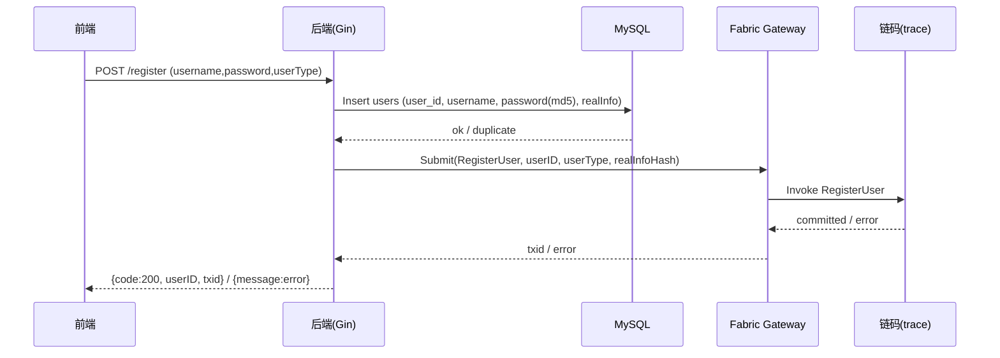
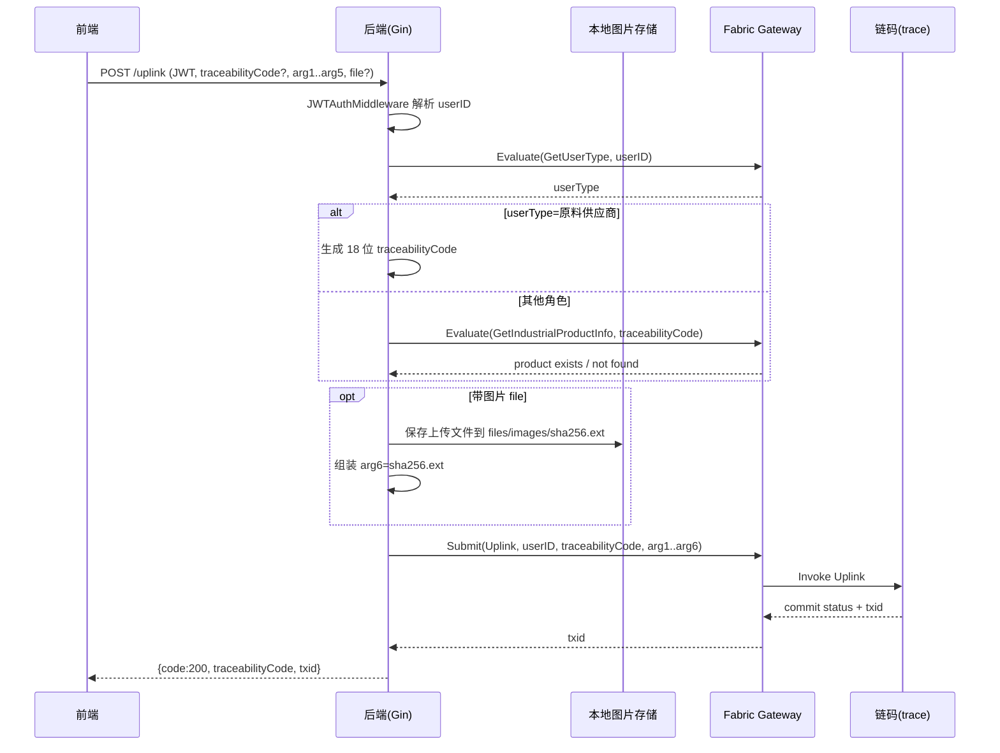
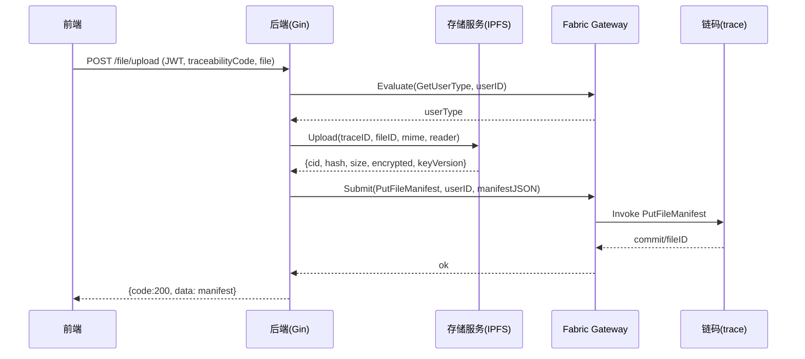
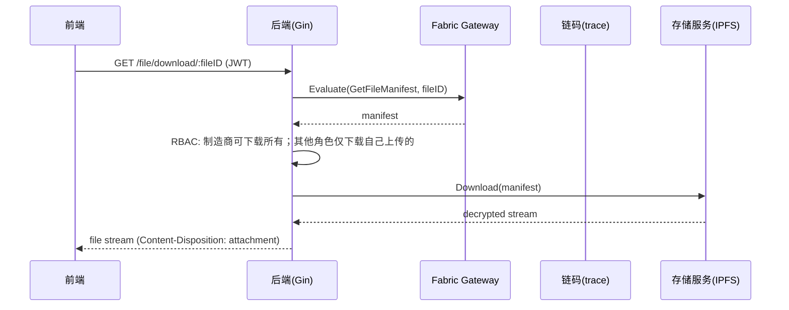
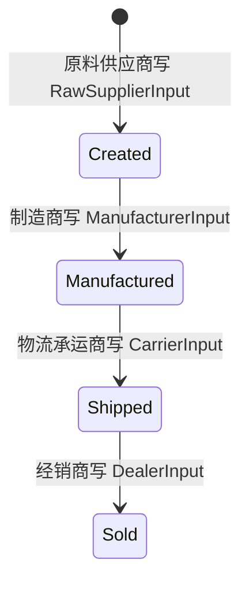

# Fabric Trace 联盟链项目

[//]: # (> 适用范围：纯 Hyperledger Fabric 联盟链（如 Fabric v2.x），链码使用 Go Contract API；链下包含后端服务（如 Go/Gin）与数据库（如 MySQL）。)

[//]: # (>)

[//]: # (> 使用方式：把本文复制一份作为你项目的 DDD，并把所有 `【待填】`、表格、清单逐项补齐。建议每次评审前更新“修订记录”。)

---

## 0. 文档元信息

### 0.1 术语表与缩略语
| 术语 | 说明 |
|------|------|
| MSP | Membership Service Provider，成员服务提供者 |
| Endorsement | 背书 |
| Orderer | 排序服务 |
| Peer | 节点 |
| Channel | 通道 |
| PDC | Private Data Collection，私有数据集合 |
| World State | 世界状态（LevelDB/CouchDB） |
| TxID | 交易 ID |
| ACL | Access Control List |

### 0.2 范围与非目标

**范围（In Scope）**
- 联盟链网络：基于 Hyperledger Fabric（仓库内置 test-network 风格脚本），支持 Docker/Compose 启停网络、创建通道、部署链码（见 `blockchain/network/`）。
- 身份/登录（链下）：
  - 提供用户注册/登录/退出 REST API（`/register`、`/login`、`/logout`），登录态通过 JWT 维持（`middleware/JWTAuthMiddleware`）。
  - 链下使用 MySQL 存储账号与密码（`application/backend/pkg/mysql.go` 等）；链上保存 userID / userType / realInfoHash。
- 身份/角色（链上）：链码 `RegisterUser` 写入用户（UserID、UserType、RealInfoHash、ProductList）。后端通过 `GetUserType` 查询角色，实现“同一套上链接口按角色写不同字段”。
- 溯源业务数据上链（核心链码与 API）：
  - 链码：`Uplink(userID, traceabilityCode, arg1..arg6)` 按用户类型写入 IndustrialProduct 的不同环节字段（原料供应商/制造商/物流承运商/经销商），并记录 TxID 与 Timestamp（Asia/Shanghai）。
  - 后端：`POST /uplink`（需 JWT）
    - 原料供应商首次上链时由后端生成 18 位 traceabilityCode；其余角色需提交已有 traceabilityCode 并校验存在。
    - 支持上传图片文件：后端将图片保存到 `files/images/`，文件名为 SHA256+扩展名；链上字段仅保存文件名（不存图片内容）。图片可通过 `GET /getImg/:filename` 访问。
- 链上数据查询：
  - `POST /getIndustrialProductInfo`：按 traceabilityCode 查询当前状态（链码 `GetIndustrialProductInfo`）。
  - `POST /getIndustrialProductHistory`（需 JWT）：按 traceabilityCode 查询历史变更（链码 `GetIndustrialProductHistory`，基于 `GetHistoryForKey`）。
  - `POST /getIndustrialProductList`（需 JWT）：查询用户关联的产品列表（链码 `GetIndustrialProductList`）。
  - `POST /getAllIndustrialProductInfo`（需 JWT）：查询全部产品信息（链码 `GetAllIndustrialProductInfo`，遍历 world state 并过滤）。
- 链上记录“链下文件/附件”的元数据（Manifest）与下载：
  - 后端接口：
    - `POST /file/upload`（需 JWT）：上传文件 →（可选）加密 → 存储（默认 IPFS）→ 调用链码 `PutFileManifest` 写入文件元数据。
    - `GET /file/download/:fileID`（需 JWT）：从链码 `GetFileManifest` 获取元数据 → 从存储下载并解密后返回。
    - `POST /file/list`（需 JWT）：按 traceabilityCode 列出文件清单（链码 `GetFileManifestsByTrace`）。
  - 链码：
    - `PutFileManifest(userID, manifestJSON)`：校验 traceabilityCode 存在、文件大小（<=50MB）、角色一致性，保存 `file:<fileID>`，并建立复合索引 `trace~file(traceabilityCode, fileID)`。
    - `GetFileManifest(fileID)` / `GetFileManifestsByTrace(traceabilityCode)`：查询元数据与列表。

**非目标（Out of Scope）（当前仓库未实现或未默认启用）**
- 不包含公链/EVM 相关能力：无 Solidity、无 Gas/nonce、无跨链。
- 不包含 Fabric 隐私增强能力：未采用 PDC（私有数据集合）、未做多通道数据隔离方案设计（当前以示例网络/单通道为主）。
- 不提供“链上细粒度访问控制治理”：
  - 链码侧未基于证书属性（MSPID/OU/Attrs）做严格 ABAC 校验；主要依赖应用层通过 userType 控制业务流转。
  - `GetAllIndustrialProductInfo` 的“管理员/审计员”权限未在链码中强制，仅在后端通过 JWT 保护接口。
- 不支持删除/更正的标准化机制：链码未提供显式 Delete/Update-Revision 模式；历史追溯仅依赖 Fabric 历史查询。
- 不提供强一致的链下索引（如 Elasticsearch）与事件订阅回放：当前查询主要直接读链（Evaluate）或遍历状态；未提供区块/事件监听构建链下索引。
- 文件存储层面：默认使用 IPFS API（`storage.type: ipfs`）；未提供生产级对象存储（S3/OSS）完备运维与容灾方案（虽配置结构预留）。
- 密钥与合规：
  - 仅提供“可选加密”的实现框架（`crypto.enabled` 与 `CRYPTO_KEY` 环境变量读取），不包含 KMS/HSM/Vault 等密钥生命周期管理方案。
  - realInfoHash 当前为 MD5(username)（仅作示例），不等同于生产级实名/隐私合规实现。

**约束与依赖（按当前代码默认配置）**
- Fabric 网络与通道：
  - 默认 chaincode 名称：`trace`（可通过环境变量 `CHAINCODE_NAME` 覆盖）。
  - 默认通道名：`mychannel`（可通过环境变量 `CHANNEL_NAME` 覆盖）。
  - Gateway/SDK 默认连接 Org1 的 Peer（`peer0.org1.example.com`），使用固定证书路径（`application/backend/pkg/fabric.go` 常量），适用于单机/示例网络；生产需改为按用户/组织动态选择身份与连接配置。
- 链下依赖：
  - MySQL：用于账号密码与 userID 映射（见 `application/backend/settings/config.yaml` 的 `mysql.*`）。
  - 文件/图片本地目录：`application/backend/files/`（图片 `files/images/`，上传暂存 `files/uploadfiles/`，下载目录 `files/downloadfiles/`）。
  - IPFS（默认）：需要可访问的 IPFS API（`storage.ipfs.api_url`，默认 `http://127.0.0.1:5001`）。
  - 加密密钥（如启用）：从环境变量 `CRYPTO_KEY` 读取 32 字节 AES key（见配置 `crypto.key_env`）。
- 客户端/接口：
  - 写入类接口（/uplink、/getIndustrialProductHistory、/getIndustrialProductList、/getAllIndustrialProductInfo、/file/*）默认要求 JWT。
  - CORS 当前允许任意来源（`AllowOrigins: *`），生产环境需要收敛。

---

## 1. 需求与用例

### 1.1 业务目标（可量化）
> 注：本小节是“产品/业务目标”，不是技术实现；但要能落到可验收指标。

- 目标 1：实现多角色、多环节的溯源数据分步写入，并具备链上不可篡改与可追溯能力。
  - 验收口径：同一 `traceabilityCode` 下，至少支持【原料供应商/制造商/物流承运商/经销商】4 个角色按顺序补充信息，最终可查询到完整 `IndustrialProduct`。
- 目标 2：提供“当前状态 + 历史变更”的查询能力，支持对外展示溯源信息。
  - 验收口径：支持查询最新状态（`GetIndustrialProductInfo`）与历史轨迹（`GetIndustrialProductHistory`，返回 TxId 与时间戳）。
- 目标 3：提供链下账号体系与接口级访问控制，保障写入接口只对登录用户开放。
  - 验收口径：对写入类与敏感查询类接口启用 JWT；无 token 或 token 无效请求应被拒绝。
- 目标 4：支持图片/附件链下存储、链上存证（仅保存引用/元数据），避免大文件直接上链。
  - 验收口径：
    - 图片：通过 `/uplink` 上传后可通过 `GET /getImg/:filename` 访问；链上字段保存文件名。
    - 附件：通过 `/file/upload` 上传后生成 manifest，并可通过 `/file/download/:fileID` 下载恢复。

**非功能目标（当前实现可作为起点，具体指标待压测确认）**
- 吞吐：支持并发接口调用，链码写入可通过 tape 进行压力测试（见 `blockchain/tape/`）。
- 可用性：在 Fabric 网络与链下 DB 正常情况下，核心接口可用。

### 1.2 角色与权限矩阵（RBAC/组织维度）
> 说明：当前实现的“角色”主要来自链上 `User.UserType`（中文枚举），后端基于此控制流程；链码本身未做基于证书属性的 ABAC 强约束。
>
> 组织维度说明（结合本仓库网络与 SDK 默认配置）：
> - 示例网络存在 Org1/Org2 两个组织（`org1.example.com` / `org2.example.com`），tape 压测配置也会同时与两个 peer 交互以满足背书与提交监听。
> - **但后端 Fabric Gateway/SDK 默认只使用 Org1 的固定身份发起所有链码调用**（`User1@org1.example.com`，MSP=`Org1MSP`，见 `application/backend/pkg/fabric.go`）。
> - 因此在当前实现中，“登录用户的业务角色（userType）”与“交易签名组织（MSP）”是解耦的：业务角色由链上 `UserType` 决定，而不是由证书组织决定。

| 角色（userType） | 组织维度（推荐口径，需按部署治理落地） | 当前实现的签名组织（事实） | 典型职责 | 是否可写链上溯源数据 | 写入入口 | 链码写入函数 | 可查询能力 | 备注 |
|------|----------|------------------------|----------|------------------|----------|--------------|----------|------|
| 原料供应商 | **建议：Org1**（或按业务把上游组织定义为 Org1） | **Org1MSP（固定）** | 创建溯源码、录入原料来源与供应信息 | 是 | `POST /uplink`（无需传 traceabilityCode） | `Uplink`（写 RawSupplierInput） | 可查询当前/历史（取决于接口是否鉴权） | traceabilityCode 由后端生成 18 位 |
| 制造商 | **建议：Org2**（或按业务把加工组织定义为 Org2） | **Org1MSP（固定）** | 录入生产批次、出厂信息等 | 是 | `POST /uplink` | `Uplink`（写 ManufacturerInput） | 可查询当前/历史 | 当前代码中，文件下载接口把“制造商”视为可下载所有附件的特权角色（见 `DownloadFile`） |
| 物流承运商 | **建议：Org2**（或单独组织/OU） | **Org1MSP（固定）** | 录入运输记录 | 是 | `POST /uplink` | `Uplink`（写 CarrierInput） | 可查询当前/历史 | 需提供已存在 traceabilityCode |
| 经销商 | **建议：Org2**（或下游独立组织） | **Org1MSP（固定）** | 录入入库/销售/门店信息 | 是 | `POST /uplink` | `Uplink`（写 DealerInput） | 可查询当前/历史 | 需提供已存在 traceabilityCode |
| 访客/消费者（匿名） | N/A | N/A | 查看溯源信息 | 否 | `POST /getIndustrialProductInfo` | - | 可查询当前状态 | 当前接口未强制鉴权，可直接查询；生产可按需加权限 |
| 管理员/审计员（JWT） | **建议：监管/平台组织（可为 Org1 或独立 Org）** | **Org1MSP（固定）** | 全量查询、审计 | 否（默认） | `POST /getAllIndustrialProductInfo` | - | 全量查询、用户信息查询（如需要） | 当前以“接口受 JWT 保护”实现，链码未强制限制 |

**组织与身份（示例网络事实清单）**
- Org1：MSP=`Org1MSP`，Peer=`peer0.org1.example.com:7051`，示例用户=`User1@org1.example.com`
- Org2：MSP=`Org2MSP`，Peer=`peer0.org2.example.com:9051`，示例用户=`User1@org2.example.com`（网络脚本会生成，但当前后端未使用）

> 若要把“角色=组织”落地：需要后端按登录用户选择不同的证书/钱包（或走 Fabric CA 为每个用户签发证书），并在链码中通过 `GetClientIdentity().GetMSPID()`/属性做 ABAC 校验。

**接口级权限（按当前路由）**
- 无需 JWT：`/register`、`/login`、`/logout`、`/getIndustrialProductInfo`、`/ping`、`/`、`/static/*`、`/getImg/:filename`
- 需要 JWT：`/getInfo`、`/uplink`、`/getIndustrialProductList`、`/getAllIndustrialProductInfo`、`/getIndustrialProductHistory`、`/file/upload`、`/file/download/:fileID`、`/file/list`

### 1.3 核心用例清单
> 来源：代码已实现接口 + `Test_Document.md` 测试用例。

| 用例 ID | 用例名称 | 触发者 | 前置条件 | 主成功路径摘要 | 失败/异常路径 |
|--------|----------|--------|----------|----------------|--------------|
| UC-001 | 用户注册 | 任意用户 | 后端可访问 MySQL；链码可用 | 调用 `/register` 写 MySQL 用户，再调用链码 `RegisterUser` 写链上用户 | 用户名重复；链码不可用；MySQL 不可用 |
| UC-002 | 用户登录并获取 JWT | 已注册用户 | UC-001 | `/login` 校验 MySQL 密码，查询链码 `GetUserType`，签发 JWT | 密码错误；用户不存在；链码查询失败 |
| UC-003 | 查询用户信息 | 登录用户 | UC-002 | `/getInfo`（JWT）获取 userType + username | JWT 无效/过期；查询失败 |
| UC-010 | 原料供应商创建溯源码并首环节上链 | 原料供应商 | 已登录且链上 userType=原料供应商 | `/uplink` 不带 traceabilityCode，后端生成 18 位 code，调用链码 `Uplink` 写 RawSupplierInput | 非法参数；链码写入失败；JWT 无效 |
| UC-011 | 制造商补链（生产环节上链） | 制造商 | UC-010 已生成 traceabilityCode；已登录 | `/uplink` 携带 traceabilityCode，链上存在校验通过，调用 `Uplink` 写 ManufacturerInput | traceabilityCode 不存在或长度非法；链码写入失败 |
| UC-012 | 物流承运商补链（物流环节上链） | 物流承运商 | UC-011 | `/uplink` 写 CarrierInput | 同上 |
| UC-013 | 经销商补链（销售环节上链） | 经销商 | UC-012 | `/uplink` 写 DealerInput | 同上 |
| UC-020 | 查询溯源当前状态 | 任意用户/消费者 | 已知 traceabilityCode | `/getIndustrialProductInfo` 调链码 `GetIndustrialProductInfo` 返回 IndustrialProduct | traceabilityCode 不存在；链码查询失败 |
| UC-021 | 查询用户关联产品列表 | 登录用户 | 用户曾写入至少一笔溯源数据 | `/getIndustrialProductList` 调链码 `GetIndustrialProductList` | JWT 无效；链码查询失败 |
| UC-022 | 全量查询所有产品（后台/审计） | 管理员/审计员 | 已登录（JWT） | `/getAllIndustrialProductInfo` 调链码遍历 world state 返回产品集合 | JWT 无效；链码查询失败；数据量大时响应慢 |
| UC-023 | 查询溯源历史轨迹 | 登录用户 | traceabilityCode 已存在且曾变更 | `/getIndustrialProductHistory` 返回历史数组（TxId、Timestamp、Record） | JWT 无效；链码查询失败 |
| UC-030 | 上链携带图片 | 可写角色 | UC-010/011/012/013 任意一步 | `/uplink` 携带 `file`，后端保存 `files/images/sha256.ext`，链上字段写入文件名 | 文件保存失败；格式/大小未限制可能导致风险 |
| UC-031 | 查看图片 | 任意用户 | UC-030 | `GET /getImg/:filename` 返回图片流 | 文件不存在（404）；路径/权限策略（生产需增强） |
| UC-040 | 上传附件并链上存证（manifest） | 登录用户 | traceabilityCode 已存在；IPFS 可用；加密密钥可用（如启用） | `/file/upload` 上传→加密（可选）→上传 IPFS→链码 `PutFileManifest` 写入元数据与索引 | traceabilityCode 不存在；超过 50MB；链码拒绝（角色/重复 fileID）；IPFS 不可用 |
| UC-041 | 下载附件（按角色控制） | 登录用户 | UC-040 | `/file/download/:fileID` 查链码 manifest→从存储下载解密返回；制造商可下载所有，其余仅本人上传 | manifest 不存在；无权限；存储不可用/解密失败 |
| UC-042 | 列出某溯源码的附件清单 | 登录用户 | UC-040 | `/file/list` 调 `GetFileManifestsByTrace` | traceabilityCode 为空；链码查询失败 |

### 1.4 业务规则与边界条件

#### 1.4.1 溯源码规则
- 溯源码字段：`traceabilityCode`（字符串）
- 生成规则（当前实现）：由“原料供应商”首次上链时在后端生成，长度固定为 18 位（雪花 ID 去掉首位）。
- 校验规则（当前实现）：
  - 非原料供应商调用 `/uplink` 时必须提供 traceabilityCode；且长度必须为 18；并且链上必须已存在该 traceabilityCode 的产品记录。

#### 1.4.2 角色与数据写入规则
- 同一条溯源数据用一个 `IndustrialProduct` 聚合对象表示，不同角色写入不同子结构：
  - 原料供应商 → `RawSupplierInput`
  - 制造商 → `ManufacturerInput`
  - 物流承运商 → `CarrierInput`
  - 经销商 → `DealerInput`
- 时间戳规则：链码写入时从交易上下文取 TxTimestamp，并统一转换到 Asia/Shanghai，格式为 `yyyy-MM-dd HH:mm:ss`。

#### 1.4.3 环节顺序约束（制造/物流/经销是否必须按序）
> 这是容易产生“数据正确性争议”的规则，本节必须写清楚。
>
> **当前实现事实（Important）**
> - 代码仅要求：非原料供应商调用 `/uplink` 时 traceabilityCode 必须存在（且长度为 18）；并不会检查“制造是否已填、物流是否已填”等依赖关系。
> - 因此当前允许“越级补链”：例如物流承运商可以在制造商未写入 ManufacturingInput 的情况下直接写 CarrierInput（只要 traceabilityCode 已存在）。
> - 链码会覆盖对应环节字段：同一环节重复提交会覆盖字段值（仍可通过 Fabric 历史查询追溯变更）。

**顺序规则表（建议评审采用两栏：现状 vs 目标）**

| 流程步骤 | 角色 | 写入字段（链上） | 是否必须在前置步骤完成后才能提交 | 当前实现是否强制 | 推荐/目标口径（建议由链码强制） |
|----------|------|------------------|----------------------------------|------------------|------------------------------|
| Step 1 | 原料供应商 | RawSupplierInput | N/A（创建起点） | ✅ 是（只有原料供应商可不传 traceabilityCode） | 必须先创建；traceabilityCode 仅允许创建一次 |
| Step 2 | 制造商 | ManufacturerInput | 建议：必须存在 RawSupplierInput | ❌ 否 | 若 RawSupplierInput 为空则拒绝；制造环节仅允许写入一次（或进入“更正流程”） |
| Step 3 | 物流承运商 | CarrierInput | 建议：必须存在 ManufacturerInput | ❌ 否 | 若 ManufacturerInput 为空则拒绝；物流环节仅允许写入一次（或更正） |
| Step 4 | 经销商 | DealerInput | 建议：必须存在 CarrierInput | ❌ 否 | 若 CarrierInput 为空则拒绝；经销环节仅允许写入一次（或更正） |

**补充约束（推荐/目标）**
- 缺失字段策略：每个环节的关键字段（如联系人电话/时间字段等）应定义必填与格式校验；建议在链码侧做长度/枚举校验，避免链下绕过。
- “更正”策略：如果业务允许修改已写入环节，不建议直接覆盖字段；建议新增 `CorrectXxx` 类函数或引入“更正记录”结构，变更原因上链。

#### 1.4.4 幂等与重复提交（按当前代码推断/需在后续设计中明确）
- `/uplink`（链码 `Uplink`）：当前实现对已有产品会先读取再覆盖写入对应字段，因此“同角色重复提交”会覆盖同字段内容。
  - 风险：覆盖会造成业务语义不清（是否允许改写历史）。
  - 建议后续：在链码中增加“环节是否已写入”的校验（拒绝/允许更新需明确），或采用追加式记录。
- 用户产品列表：链码 `AddIndustrialProduct` 对同一 user 的 `ProductList` 做去重校验（同 traceabilityCode 只允许追加一次）；重复会报错。

#### 1.4.5 查询规则与访问边界
- 当前状态查询：默认对外开放（`/getIndustrialProductInfo` 无 JWT）。
- 历史查询/用户列表/全量查询：需 JWT。
- 全量查询：链码通过 `GetStateByRange("", "")` 遍历世界状态并过滤 `TraceabilityCode != ""` 的对象；数据量大时响应会变慢，属于已知边界。

#### 1.4.6 文件与图片规则
- 图片（/uplink 附带 file）：
  - 存储：本地目录 `files/images/`。
  - 上链：仅存文件名（sha256.ext）。
  - 访问：`GET /getImg/:filename` 当前无鉴权。
- 附件（/file/upload）：
  - 单文件上限：50MB（链码与后端均有限制）。
  - 存储：默认 IPFS；链上存 manifest（包含 CID、Hash、Mime、Size、Encrypted、KeyVersion、Role、Uploader、Timestamp）。
  - 访问控制：下载接口中“制造商可下载所有，其余仅本人上传”。

---

## 2. 总体架构设计

### 2.1 系统组成与边界

#### 2.1.1 前端（application/web）
- 技术栈：Vue（Vue CLI）+ Element UI（管理端/溯源展示）。
- 职责：
  - 登录/注册、角色进入（基于 JWT 的前端存储与路由控制）。
  - 溯源上链表单提交：按角色收集 `arg1~arg5`，可选上传图片（multipart/form-data）。
  - 溯源查询：调用查询接口展示当前信息与（可选）历史。
- 部署方式：
  - 开发：Vue devServer（默认 9528）
  - 生产：`npm run build` 输出到 `dist/`，由后端 Gin 静态托管（见后端路由 `r.Static("/static", "./dist/static")` + `LoadHTMLGlob("dist/*.html")`）。

#### 2.1.2 后端服务（application/backend）
- 技术栈：Go + Gin，配置使用 Viper；与 Fabric 交互使用 `fabric-gateway`（Gateway 模式）。
- 职责边界：
  - API 网关层：提供 REST API（用户、溯源上链、查询、文件上传下载、图片访问）。
  - 鉴权：JWT 登录态；对写入/敏感查询接口做中间件保护（`JWTAuthMiddleware`）。
  - 链交互适配：封装 `ChaincodeQuery` / `ChaincodeInvoke` 统一调用链码（Evaluate/SubmitAsync + commit status）。
  - 链下数据库：MySQL 存储账号密码与 userID 映射（`MysqlInit` 会自动创建数据库与 users 表）。
  - 文件处理：
    - 图片：保存到本地 `files/images/`，链上仅保存文件名。
    - 附件：走 `storage` 服务（默认 IPFS）+ 可选加密，并把 manifest 上链。

#### 2.1.3 链上合约/链码（blockchain/chaincode）
- 技术栈：Go Contract API（`contractapi`）。
- 职责边界：
  - 业务状态存储：用户（User）与溯源聚合对象（IndustrialProduct）。
  - 溯源写入：`Uplink` 按 userType 写入不同环节字段，记录 TxID/时间戳。
  - 查询：当前状态、历史轨迹、用户关联列表、全量遍历。
  - 链下文件存证：保存 FileManifest（`file:<fileID>`）并建立 traceabilityCode→fileID 的复合索引（`trace~file`）。

#### 2.1.4 Fabric 网络与环境（blockchain/network）
- 组件：Org1/Org2 两组织、各 1 个 peer；排序服务（Raft，示例网络默认）。
- 通道：默认 `mychannel`。
- 链码：默认名称 `trace`。
- 说明：后端 Gateway 默认使用 Org1 固定身份调用链码（见 1.2）。

#### 2.1.5 存储与数据分层
- 链上（Ledger）：
  - World State：KV（示例网络常见为 LevelDB 或 CouchDB，取决于网络配置）。
  - Block：交易与历史不可篡改记录；历史查询使用 `GetHistoryForKey`。
- 链下（Off-chain）：
  - MySQL：用户登录凭据与 userID 映射。
  - 本地文件目录：图片 `files/images/`、上传暂存 `files/uploadfiles/`。
  - IPFS（默认）：附件内容存储；链上仅保存 CID/Hash/Size/Mime/加密信息等 manifest。

---

### 2.2 架构图（与当前仓库一致）
```mermaid
flowchart LR
  subgraph Client[客户端]
    FE[Web 前端\nVue + ElementUI]
  end

  subgraph App[应用层 / application]
    BE[后端 API\nGo + Gin]
    JWT[JWT 鉴权\nMiddleware]
    DB[(MySQL\nusers 表)]
    IMG[(本地图片目录\nfiles/images)]
    STG[(附件存储\nIPFS / 可扩展 S3/local)]
  end

  subgraph Fabric[Fabric 联盟链]
    GW[Fabric Gateway\n(fabric-gateway)]
    CH[Channel: mychannel]
    CC[Chaincode: trace\nGo Contract API]
    WS[(World State\nLevelDB/CouchDB)]
    PEER1[Peer0 Org1]
    PEER2[Peer0 Org2]
    OSN[Orderer\nRaft]
  end

  FE -->|HTTP/HTTPS| BE
  BE --> JWT
  BE <--> DB
  BE <--> IMG
  BE <--> STG

  BE -->|gRPC TLS| GW
  GW --> CH
  CH --> CC
  CC <--> WS
  CC --> PEER1
  CC --> PEER2
  PEER1 --> OSN
  PEER2 --> OSN
```

---

### 2.3 核心数据流与时序图（至少 2 个）

#### 2.3.1 用例：用户注册（链下入库 + 链上注册）


#### 2.3.2 用例：多角色溯源上链（同一接口按 userType 分支）


#### 2.3.3 用例：附件上传与链上存证（IPFS + manifest 上链）


#### 2.3.4 用例：附件下载（链上取 manifest + 解密下载）


---

### 2.4 技术选型与理由（关键决策记录）
| 领域 | 选型 | 备选方案 | 选择理由（基于当前仓库） | 影响 |
|------|------|----------|--------------------------|------|
| 联盟链平台 | Hyperledger Fabric（示例网络 Org1/Org2 + Raft orderer） | Besu/FISCO/Ethereum | 适合多组织联盟链；支持背书、通道、访问控制与审计；仓库直接提供网络脚本与浏览器/压测工具生态 | 需要运维组织/证书与网络配置；链上权限应尽量在链码侧落实 |
| 链码语言 | Go Contract API（contractapi） | Java/Node | 与现有链码实现一致，开发与部署成本低；结构化 model 与函数清晰 | 需控制链码升级与兼容；输入校验应补齐 |
| 链交互模式 | Fabric Gateway (`fabric-gateway`) | Fabric SDK Go (legacy) | 新版推荐模式；后端已封装 Evaluate/SubmitAsync+CommitStatus | 当前实现使用固定身份（Org1 User1），若需多组织真实签名需改造 |
| 后端框架 | Gin（Go） | Java Spring / Node Koa | 轻量高性能，易做中间件；与 Go 链码生态一致 | 需要补齐统一错误码与日志追踪（traceId/txid） |
| 账号体系 | 链下 MySQL + JWT | 纯证书登录 / OAuth | 更贴近常规 Web 应用；降低用户使用门槛；链上仅保存 userType 等关键字段 | 注意密码存储（当前为 MD5）与合规；JWT secret 需妥善管理 |
| 文件方案 | 图片本地存储 + 附件 IPFS + 链上 manifest | 全部上链 / 对象存储 S3 | 避免大文件上链；链上可验证元数据（hash/cid/size） | 运维需要 IPFS；访问控制与链接暴露风险需加强 |
| 部署交付 | Docker 多阶段构建（Go + Node，最终 Alpine 运行） | 纯二进制部署 / k8s | 仓库提供一体化镜像：编译后端 + 构建前端 dist 并内置到镜像，便于演示/交付 | 需要准备 network/organizations 证书挂载或复制；生产建议外置配置与密钥 |

---

## 3. Fabric 网络与治理设计（联盟链专属）

### 3.1 网络拓扑

#### 3.1.1 组织与节点（按本仓库 test-network 配置）
| 组织 | MSP ID | Peer 节点 | Peer 端口映射 | 备注 |
|------|--------|-----------|---------------|------|
| Org1 | `Org1MSP` | `peer0.org1.example.com` | `7051`（peer）、`9444`（ops） | 示例网络默认 org1 |
| Org2 | `Org2MSP` | `peer0.org2.example.com` | `9051`（peer）、`9445`（ops） | 示例网络默认 org2 |

| 排序组织 | MSP ID | Orderer 节点 | 端口映射 | 共识 |
|---------|--------|--------------|----------|------|
| OrdererOrg | `OrdererMSP` | `orderer.example.com` | `7050`（grpc）、`7053`（admin）、`9443`（ops） | Raft（`etcdraft`） |

- Docker/Compose 文件：`blockchain/network/compose/compose-test-net.yaml`
- Fabric 配置生成（Profile）：`blockchain/network/configtx/configtx.yaml`（`ChannelUsingRaft`）

#### 3.1.2 共识与排序服务
- 共识类型：Raft（`OrdererType: etcdraft`）。
- Consenter 列表（示例网络）：仅 1 个 orderer（`orderer.example.com:7050`）。
- 块参数（示例配置）：
  - `BatchTimeout: 2s`
  - `MaxMessageCount: 10`
  - `PreferredMaxBytes: 512 KB`

> 说明：单 Orderer 的 Raft 仅适合演示/开发；生产建议至少 3 节点（容错 1）。

#### 3.1.3 证书与 TLS
- 网络默认生成方式：`cryptogen`（见 `blockchain/network/network.config: CRYPTO="cryptogen"`），也支持 `-ca`（Fabric CA）与 `-cfssl`。
- Peer/Orderer 容器启动默认启用 TLS（compose 中 `*_TLS_ENABLED=true`）。

#### 3.1.4 监控/运维端口
- Orderer ops：`9443`（Prometheus metrics）
- Peer ops：`9444`（org1）、`9445`（org2）

---

### 3.2 通道（Channel）规划

#### 3.2.1 通道列表（当前实现）
| Channel | 成员组织 | 账本用途 | 是否涉及隐私数据 | 备注 |
|---------|----------|----------|------------------|------|
| `mychannel` | Org1MSP、Org2MSP | 溯源业务主账本（用户、产品、附件 manifest） | 否（当前未启用 PDC） | 默认通道名，脚本默认值（`network.config` / `scripts/createChannel.sh`） |

#### 3.2.2 未来扩展建议（未在当前仓库实现）
- 若存在多业务域、不同数据可见性需求：
  - 方案 A：多通道隔离（例如 `trace-public` / `trace-b2b`）
  - 方案 B：单通道 + PDC（私有数据集合）

---

### 3.3 背书策略（Endorsement Policy）

#### 3.3.1 链码级默认策略（当前仓库事实）
- 链码名：`trace`
- 通道：`mychannel`
- 部署脚本：`blockchain/network/scripts/deployCC.sh`（由 `network.sh deployCC ...` 调用）
- 默认背书策略：**未显式指定**（`-ccep` 默认 `NA`），因此使用 Fabric 的默认策略：
  - `Application/Endorsement: MAJORITY Endorsement`
  - 在本网络中 Application orgs 为 Org1MSP + Org2MSP，因此“多数背书”≈ **需要 Org1 与 Org2 都背书**。

> 佐证：`scripts/utils.sh` 中对 `-ccep` 的说明写道“默认策略需要 Org1 和 Org2 背书”。

#### 3.3.2 可配置策略（脚本支持，当前未启用）
- `network.sh deployCC -ccep '<signature-policy>'` 可按链码定义设置签名策略，例如：
  - `OR('Org1MSP.peer','Org2MSP.peer')`（放宽，性能更好，但信任假设更弱）
  - `AND('Org1MSP.peer','Org2MSP.peer')`（更强约束）

#### 3.3.3 建议
- 若业务要求“上下游共同认可才上链”：保持默认 MAJORITY（双组织背书）或显式 `AND`。
- 若业务要求“上游自证 + 下游可验证”且追求性能：可考虑 `OR`，并通过应用层/审计机制补足。

---

### 3.4 ACL 与通道配置策略

#### 3.4.1 通道策略（configtx.yaml 的默认设置）
- Channel 级：
  - Readers：`ANY Readers`
  - Writers：`ANY Writers`
  - Admins：`MAJORITY Admins`
- Application 级：
  - Admins：`MAJORITY Admins`
  - Endorsement：`MAJORITY Endorsement`
  - LifecycleEndorsement：`MAJORITY Endorsement`

> 这些属于 Fabric“隐式元策略（ImplicitMeta）”，对联盟链治理很关键：
> - 例如升级链码的审批，需要多数组织管理员参与。

#### 3.4.2 配置更新流程（建议落地为运维 Runbook）
- 变更范围：通道成员、锚节点、背书策略、ACL、PDC、orderer 参数等。

**本仓库可直接复用的脚本入口（推荐）**
- 通道 config block 拉取与 configtxlator 相关封装：`blockchain/network/scripts/configUpdate.sh`
  - `fetchChannelConfig <org> <channel> <output.json>`：拉取最新 config block 并抽取 `config` 到 json
  - `createConfigUpdate <channel> <original.json> <modified.json> <output.pb>`：计算 config update（envelope）
  - `signConfigtxAsPeerOrg <org> <configtx.pb>`：用指定组织 admin 签名
- 锚节点更新：`blockchain/network/scripts/setAnchorPeer.sh`（内部调用 `configUpdate.sh`）

**典型命令片段：拉取 config block → 修改 → 生成 delta → 多方签名 → 提交更新**
> 注意：`configtxlator` 与 `jq` 通常在 `cli` 容器里更容易保证可用；本仓库脚本也是按“在 cli 容器内执行”设计。

1) 进入 `blockchain/network`，启动网络并进入 cli（示例）
```bash
cd blockchain/network
# 网络已启动时可跳过
./network.sh up createChannel

# 进入 cli 容器（compose-test-net.yaml 定义了 service: cli）
docker exec -it cli bash
```

2) 在 cli 容器内：拉取并导出通道配置（Org1 视角）
```bash
cd /opt/gopath/src/github.com/hyperledger/fabric/peer

# 生成 config.json（只包含 .data.data[0].payload.data.config 部分）
./scripts/configUpdate.sh
fetchChannelConfig 1 mychannel config.json
```

3) 修改 config.json（示例：仅示意，具体 jq 变更按你的治理需求编写）
```bash
# 示例：把 config.json 复制成 modified_config.json，然后用 jq 做结构化修改
cp config.json modified_config.json
# jq '...对 modified_config.json 做修改...' config.json > modified_config.json
```

4) 计算 update envelope（生成 org_update_in_envelope.pb）
```bash
createConfigUpdate mychannel config.json modified_config.json org_update_in_envelope.pb
```

5) 多组织签名（以 2 组织为例，满足 MAJORITY Admins）
```bash
# Org1 admin 签名
signConfigtxAsPeerOrg 1 org_update_in_envelope.pb

# Org2 admin 再签名
signConfigtxAsPeerOrg 2 org_update_in_envelope.pb
```

6) 提交更新（用任一组织 admin 执行 channel update 即可）
```bash
setGlobals 1
peer channel update \
  -o orderer.example.com:7050 --ordererTLSHostnameOverride orderer.example.com \
  -c mychannel -f org_update_in_envelope.pb \
  --tls --cafile "$ORDERER_CA"
```

> 说明：上面的函数名（fetchChannelConfig/createConfigUpdate/signConfigtxAsPeerOrg）来自 `scripts/configUpdate.sh`；如果你希望“完全不写函数、全是原生命令”，也可以直接参考该脚本内容逐条执行。

**配置更新治理建议（文档化要求）**
- 每次更新需记录：变更目的、原 config block hash、新 config block hash、参与签名组织与管理员 DN、提交时间、回滚预案。

#### 3.4.3 锚节点更新与组织加入通道（仓库对应路径）

**锚节点更新（Anchor Peer）**
- 在本仓库中，创建通道完成后会自动设置 Org1/Org2 的锚节点：
  - 入口：`blockchain/network/scripts/createChannel.sh`
    - 末尾：`setAnchorPeer 1`、`setAnchorPeer 2`
  - 实际执行：`docker exec cli ./scripts/setAnchorPeer.sh <org> <channel>`
  - 锚节点更新脚本：`blockchain/network/scripts/setAnchorPeer.sh`
    - 拉取 config：调用 `fetchChannelConfig`（来自 `scripts/configUpdate.sh`）
    - 修改位置：向 `Application.groups.<OrgMSP>.values` 追加 `AnchorPeers`
    - 生成 tx：`createConfigUpdate ... <OrgMSP>anchors.tx`
    - 提交：`peer channel update ... -f <OrgMSP>anchors.tx`

**组织加入通道（Org1/Org2）**
- 主流程由 `blockchain/network/scripts/createChannel.sh` 完成：
  - 生成通道 block：`configtxgen -profile ChannelUsingRaft -outputBlock ./channel-artifacts/mychannel.block`
  - orderer 添加 channel（channel participation）：`. scripts/orderer.sh <channel>`
  - peer 加入：`peer channel join -b ./channel-artifacts/mychannel.block`

**扩展加入 Org3（仓库有示例，但默认不走）**
- 添加 Org3 的脚本入口：`blockchain/network/addOrg3/addOrg3.sh`
- Org3 加入通道与设置锚节点的脚本：`blockchain/network/scripts/org3-scripts/joinChannel.sh`
  - 拉取通道块：`peer channel fetch 0 mychannel.block ...`
  - 加入通道：`peer channel join -b mychannel.block`
  - 设置锚节点：调用 `scripts/setAnchorPeer.sh 3 mychannel`

#### 3.4.4 当前仓库的实际情况
- 当前网络主要通过 `network.sh` 脚本一键启停与创建通道/部署链码（开发/演示导向）。
- 链码侧未基于证书属性做 ABAC 强校验，更多权限控制在应用层（JWT + userType）。

---


## 4. 链上数据与链码详细设计（Chaincode）


### 4.1 链码包信息
- 链码名称：`trace`
  - 部署脚本默认：`blockchain/network/start.sh` 使用 `./network.sh deployCC -ccn trace -ccp ../chaincode -ccl go`
- 目录位置：`blockchain/chaincode/`
  - 入口：`blockchain/chaincode/trace.go`
  - 合约实现：`blockchain/chaincode/chaincode/smartcontract.go`
  - 数据结构：`blockchain/chaincode/chaincode/model.go`
- 合约结构：单合约（`SmartContract`）
- 初始化函数（InitLedger/无）：无（仓库中未实现 `InitLedger`，部署脚本默认也不要求 init）
- 链码依赖：
  - `github.com/hyperledger/fabric-contract-api-go v1.2.1`
  - `github.com/hyperledger/fabric-chaincode-go`（shim）

### 4.2 世界状态（World State）Key 设计

#### 4.2.1 Key 总览（按当前实现）
| 对象类型 | Key 模式 | 示例 | Value Schema 版本 | 备注 |
|----------|----------|------|-------------------|------|
| 用户 User | `<userID>`（直接用 userID 作为 key） | `1693476200xxxx` | v1（隐式） | `RegisterUser` / `GetUserType` / `GetUserInfo` / `AddIndustrialProduct` |
| 工业产品 IndustrialProduct | `<traceabilityCode>`（直接用 traceabilityCode 作为 key） | `123456789012345678` | v1（隐式） | `Uplink` / `GetIndustrialProductInfo` / `GetIndustrialProductHistory` |
| 文件元数据 FileManifest | `file:<fileID>` | `file:8f1c...` | v1（隐式） | `PutFileManifest` / `GetFileManifest` |
| trace→file 索引 | composite key：`trace~file(traceabilityCode, fileID)` | `trace~file\x001234...\x008f1c...` | v1（隐式） | 用于按 traceabilityCode 列表查询文件（`GetFileManifestsByTrace`） |

**Key 规范（当前实现事实）**
- 用户与产品 key 没有对象前缀，直接占用全局 keyspace。
  - 风险：需要依靠 `GetAllIndustrialProductInfo` 通过 `TraceabilityCode != ""` 过滤，避免把用户对象误当作产品。
  - 建议：后续演进可将用户 key 改为 `user:<userID>`，产品 key 改为 `trace:<traceabilityCode>`，减少遍历和误判。

**字符集与长度**
- 当前未做严格限制（链码仅在业务层按 18 位 traceabilityCode 使用）；建议限制为 `[0-9A-Za-z:_-]` 并控制长度（<= 128）。

### 4.3 链上数据结构（Schema 字典）

#### 4.3.1 对象：User（`model.go`）
| 字段 | 类型 | 必填 | 约束 | 示例 | 说明 |
|------|------|------|------|------|------|
| userID | string | Y | 非空 | `u-001` | 链下 MySQL 分配/生成的用户 ID，同步上链作为主键 |
| userType | string | Y | 枚举：原料供应商/制造商/物流承运商/经销商 | `制造商` | 业务角色（**不是 Fabric 证书角色**） |
| realInfoHash | string | N | 当前实现为 MD5(username)（示例） | `5d4140...` | 仅存哈希；并非生产级实名体系 |
| productList | array<IndustrialProduct> | Y | 初始为空数组；追加时做 traceabilityCode 去重 | - | 用户关联产品列表；用于 `/getIndustrialProductList` |

#### 4.3.2 对象：IndustrialProduct（`model.go`）
| 字段 | 类型 | 必填 | 约束 | 示例 | 说明 |
|------|------|------|------|------|------|
| traceabilityCode | string | Y | 业务上为 18 位字符串（后端生成/校验） | `123456789012345678` | 溯源码，亦为世界状态 key |
| rawSupplierInput | RawSupplierInput | N | - | - | 原料环节数据 |
| manufacturerInput | ManufacturerInput | N | - | - | 制造环节数据 |
| carrierInput | CarrierInput | N | - | - | 物流环节数据 |
| dealerInput | DealerInput | N | - | - | 经销环节数据 |

#### 4.3.3 子结构：RawSupplierInput / ManufacturerInput / CarrierInput / DealerInput
> 四个环节结构体字段均包含：业务字段 + `img` + `txid` + `timestamp`；timestamp 格式为 `yyyy-MM-dd HH:mm:ss`（Asia/Shanghai）。

RawSupplierInput
| 字段 | 类型 | 必填 | 说明 |
|------|------|------|------|
| productName/rawOrigin/arrivalTime/productionTime/supplierName | string | N（当前未强校验） | 原料供应商填写 |
| img | string | N | 图片文件名（链下保存，链上仅存文件名） |
| txid | string | N | 写入本环节的 TxID |
| timestamp | string | N | 写入本环节的链上时间（Asia/Shanghai） |

ManufacturerInput
| 字段 | 类型 | 必填 | 说明 |
|------|------|------|------|
| productName/productionBatch/factoryTime/factoryNameAddress/contactPhone | string | N | 制造商填写 |
| img/txid/timestamp | string | N | 同上 |

CarrierInput
| 字段 | 类型 | 必填 | 说明 |
|------|------|------|------|
| name/age/phone/plateNumber/transportRecord | string | N | 物流承运商填写 |
| img/txid/timestamp | string | N | 同上 |

DealerInput
| 字段 | 类型 | 必填 | 说明 |
|------|------|------|------|
| storeTime/sellTime/dealerName/dealerLocation/dealerPhone | string | N | 经销商填写 |
| img/txid/timestamp | string | N | 同上 |

#### 4.3.4 历史记录结构（链码返回）
| 字段 | 类型 | 说明 |
|------|------|------|
| txId | string | Fabric TxID |
| timestamp | string | 由区块时间戳转换到 Asia/Shanghai 并格式化 |
| isDelete | bool | 是否删除（当前链码不提供 delete，但历史 API 仍可能返回 false） |
| record | IndustrialProduct | 当次状态快照（json 反序列化） |

#### 4.3.5 对象：FileManifest（链上附件存证）
| 字段 | 类型 | 必填 | 约束 | 说明 |
|------|------|------|------|------|
| traceabilityCode | string | Y | 非空 | 关联溯源码 |
| fileID | string | Y | 非空 | 文件业务 ID（链下生成），链上 key 为 `file:<fileID>` |
| cid | string | Y | 非空 | IPFS CID |
| hash | string | Y | 非空 | 文件内容 hash（链下计算） |
| mime | string | N | - | MIME 类型 |
| size | int64 | Y | 0 < size <= 50MB | 链码强校验大小上限 |
| encrypted | bool | Y | - | 是否加密 |
| keyVersion | string | 条件必填 | encrypted=true 时必填 | 加密密钥版本 |
| role | FileRole | N（会被链码覆盖/校验） | 枚举：raw_supplier/manufacturer/carrier/dealer | 由 userType 映射得到 |
| uploader | string | N（链码写入） | - | 上传者 userID |
| timestamp | string | N（链码写入） | - | 上链时间（Asia/Shanghai） |

---

### 4.4 状态机与业务约束（基于当前实现 + 建议）

#### 4.4.1 产品聚合状态（建议抽象）
> 当前链码未显式维护 `stage/status` 字段；可用“是否已填某环节 Txid”作为隐式状态。



- 当前实现强制/校验：
  - 链码侧：不校验环节顺序、不校验 traceabilityCode 是否首次创建（允许覆盖写/越级写入）。
  - 应用侧：非原料角色要求 traceabilityCode 已存在（见 1.4.1）。
- 推荐演进：把 1.4.3 的“顺序规则”下沉到链码（拒绝越级写入），并明确是否允许同环节覆盖更新。

---

### 4.5 链码函数设计（逐一填表）

> 注意：当前链码未定义事件（SetEvent），无显式错误码体系；错误以 `error` 文本返回，由链下映射为 HTTP 200/业务 message。

#### 4.5.1 函数：`RegisterUser`
- 类型：写交易（Submit）
- 功能描述：注册用户到链上，写入 `User{userID,userType,realInfoHash,productList=[]}`。
- 调用方（角色/组织）：任意（当前链码未做 ABAC）；实际由后端 `/register` 触发。
- 背书/权限要求：依赖通道默认背书策略（MAJORITY）；链码侧无额外限制。
- 幂等语义：**覆盖**（若 userID 已存在会直接 PutState 覆盖）。

**入参**
| 参数名 | 类型 | 必填 | 校验规则 | 示例 |
|--------|------|------|----------|------|
| userID | string | Y | 非空（当前未显式校验） | `u-001` |
| userType | string | Y | 建议限定枚举；当前未校验 | `制造商` |
| realInfoHash | string | N | - | `md5(...)` |

**读写集**
- 读取：无
- 写入：`PutState(userID, userJSON)`

**事件**：无

**边界与异常**
- 如果 userID 冲突，会覆盖旧用户（风险：角色/实名被改写）。

---

#### 4.5.2 函数：`GetUserType`
- 类型：只读查询（Evaluate）
- 功能描述：读取 userID 对应用户并返回 `userType`。
- 幂等：查询类。

**入参**：`userID`（string，必填）

**读写集**
- 读取：`GetState(userID)`
- 写入：无

**异常**
- user 不存在：返回 `the user <id> does not exist`

---

#### 4.5.3 函数：`GetUserInfo`
- 类型：只读查询（Evaluate）
- 功能描述：读取 userID 对应用户结构体。

**入参**：`userID`（string，必填）

**读写集**：`GetState(userID)`

---

#### 4.5.4 函数：`Uplink`
- 类型：写交易（Submit）
- 功能描述：按 `userType` 写入 `IndustrialProduct` 的对应环节字段（RawSupplierInput/ManufacturerInput/CarrierInput/DealerInput），并写入 TxID 与 Timestamp。
- 调用方：业务上为四类可写角色；当前链码未做 ABAC。
- 背书/权限要求：依赖通道默认背书策略（MAJORITY）。
- 幂等语义：**覆盖**（同 traceabilityCode 再提交会覆盖相应环节字段）。

**入参**

| 参数名 | 类型 | 必填 | 校验规则（当前实现） | 示例 |
|--------|------|------|----------------------|------|
| userID | string | Y | 必须存在对应用户（`GetUserType` 会检查） | `u-001` |
| traceabilityCode | string | Y | 链码不校验格式；上层要求 18 位 | `123...` |
| arg1..arg5 | string | N | 不校验 | - |
| arg6 | string | N | 图片文件名（可空） | `sha256.jpg` |

**参数语义（按 userType 分支）**
- 原料供应商：
  - arg1=ProductName, arg2=RawOrigin, arg3=ArrivalTime, arg4=ProductionTime, arg5=SupplierName, arg6=Img
- 制造商：
  - arg1=ProductName, arg2=ProductionBatch, arg3=FactoryTime, arg4=FactoryNameAddress, arg5=ContactPhone, arg6=Img
- 物流承运商：
  - arg1=Name, arg2=Age, arg3=Phone, arg4=PlateNumber, arg5=TransportRecord, arg6=Img
- 经销商：
  - arg1=StoreTime, arg2=SellTime, arg3=DealerName, arg4=DealerLocation, arg5=DealerPhone, arg6=Img

**读写集**
- 读取：
  - `GetState(traceabilityCode)`（若存在则反序列化并更新字段，否则作为空结构新建）
  - `GetState(userID)`（在 GetUserType 内部读取）
- 写入：
  - `PutState(traceabilityCode, productJSON)`
  - `PutState(userID, userJSON)`（在 AddIndustrialProduct 内）

**异常与边界**
- user 不存在：失败。
- 产品不存在：在链码层允许创建（因为 productAsBytes nil 时不会报错）。
- 用户产品列表去重：若 user.ProductList 已有该 traceabilityCode，会报错（即使本次 uplink 是覆盖写产品字段）。这会产生“产品可更新但列表不可重复追加”的语义。

---

#### 4.5.5 函数：`AddIndustrialProduct`（内部辅助）
- 类型：写交易（Submit，内部被 Uplink 调用）
- 功能描述：把 IndustrialProduct 追加到 User.productList，并按 traceabilityCode 去重。
- 幂等：非幂等（重复会报错）。

**读写集**：`GetState(userID)` → `PutState(userID, userJSON)`

---

#### 4.5.6 函数：`GetIndustrialProductInfo`
- 类型：只读查询（Evaluate）
- 功能描述：按 traceabilityCode 查询产品当前状态。

**读写集**：`GetState(traceabilityCode)`

**异常**
- key 不存在或反序列化后 `TraceabilityCode==""`：返回 “the industrial product ... does not exist”。

---

#### 4.5.7 函数：`GetIndustrialProductList`
- 类型：只读查询（Evaluate）
- 功能描述：读取 User 并返回 `productList`。

**读写集**：`GetState(userID)`

---

#### 4.5.8 函数：`GetAllIndustrialProductInfo`
- 类型：只读查询（Evaluate）
- 功能描述：遍历 world state 返回所有 `IndustrialProduct`。

**读写集**
- 读取：`GetStateByRange("", "")` 全量遍历
- 过滤：仅保留 `TraceabilityCode != ""` 的对象（避免把 User/FileManifest 索引对象混入）

**性能边界**
- O(N) 遍历，数据量大时会慢；生产建议改为前缀 key 或 CouchDB 富查询 + 分页。

---

#### 4.5.9 函数：`GetIndustrialProductHistory`
- 类型：只读查询（Evaluate）
- 功能描述：基于 `GetHistoryForKey(traceabilityCode)` 返回历史数组（TxId、Timestamp、Record、IsDelete）。

**读写集**：历史迭代器（不改写 world state）

---

#### 4.5.10 函数：`PutFileManifest`
- 类型：写交易（Submit）
- 功能描述：把链下文件元数据（manifest）上链存证，并建立 traceabilityCode→fileID 的索引。
- 背书：同链码默认背书策略。
- 幂等：**拒绝重复**（fileID 已存在则报错）。

**入参**
| 参数名 | 类型 | 必填 | 校验规则（链码强校验） |
|--------|------|------|------------------------|
| userID | string | Y | 必须存在用户（GetUserType） |
| manifestJSON | string(JSON) | Y | 必须包含 traceabilityCode/fileID/cid/hash；size (0, 50MB]；encrypted=true 则 keyVersion 必填；role 与 userType 映射一致（或由链码覆盖） |

**读写集**
- 读取：
  - `GetState("file:"+fileID)`（查重）
  - `GetState(traceabilityCode)`（通过 GetIndustrialProductInfo 验证产品存在）
  - `GetState(userID)`（通过 GetUserType）
- 写入：
  - `PutState("file:"+fileID, manifestJSON')`
  - `PutState(CreateCompositeKey("trace~file", [traceabilityCode,fileID]), 0x00)`

---

#### 4.5.11 函数：`GetFileManifest`
- 类型：只读查询（Evaluate）
- 功能描述：按 fileID 读取 `file:<fileID>`。

---

#### 4.5.12 函数：`GetFileManifestsByTrace`
- 类型：只读查询（Evaluate）
- 功能描述：按 traceabilityCode 扫描 `trace~file` 复合索引，再逐个读取 manifest。

**读写集**
- 读取：`GetStateByPartialCompositeKey("trace~file", [traceabilityCode])` + 多次 `GetState("file:"+fileID)`
- 写入：无

**性能边界**
- manifest 数量多时会按数量线性增加读取次数；可考虑引入分页或把部分字段冗余到索引 value。

---

### 4.6 访问控制（链码侧）

#### 4.6.1 当前实现事实
- 链码未基于 `GetClientIdentity()` 做 ABAC 校验；任何能通过背书提交交易的客户端身份原则上都可调用写函数。
- 业务角色鉴别来自链上 `User.UserType` 字段（由 `RegisterUser` 写入）。

#### 4.6.2 建议（生产）
- 用 `GetClientIdentity().GetMSPID()` 将“组织=角色”落地，或用 Attribute + OU 做更细粒度控制。
- 对写交易（RegisterUser/Uplink/PutFileManifest）增加：
  - 调用者必须属于允许的 MSP
  - 调用者证书属性与 `userID` 映射一致（避免冒用 userID）

### 4.7 富查询/历史查询设计（若 World State 为 CouchDB）
- 当前实现：
  - 未使用 CouchDB 富查询；全量查询走 `GetStateByRange`。
  - 历史查询使用 `GetHistoryForKey`。
- 网络可选：`network.sh up createChannel -s couchdb`（仓库 compose 提供 couchdb 配置），但链码目前没有索引文件与分页协议。

### 4.8 合约升级与数据兼容
- 版本号策略（建议）：与 `peer lifecycle chaincode` 的 `--version`/`--sequence` 协同；按 SemVer 维护（例如 `1.0.0`、`1.1.0`）。
- 当前数据兼容风险：
  - Schema 未显式版本字段；结构体字段变化需保证 JSON 兼容（新增字段 OK；重命名/删除字段会影响历史数据反序列化）。
  - Key 设计（用户与产品无遮罩前缀）一旦调整，需要迁移策略。
- 数据迁移策略（建议）：
  - 如果仅新增字段：无需迁移。
  - 如果变更 key 或拆分对象：提供一次性迁移函数（读取旧 key 写新 key）或通过链下脚本重放。
- 回退策略：Fabric 通常不建议回退链码版本；通过发布新版本修复并保持兼容。

---

## 5. 链下服务详细设计（后端 API）

### 5.1 模块划分与目录说明
- 后端语言/框架：Go + Gin
- 配置加载：Viper + `application/backend/settings`（`settings.Init()` 读取 `settings/config.yaml`）
- 目录结构（对齐仓库）
  - `main.go`
    - 启动流程：`settings.Init()` → `pkg.MysqlInit()` → `router.SetupRouter()` → `r.Run(:9090)`
  - `router/router.go`
    - 路由注册、CORS、静态资源托管（`/static` + `index.html`）
  - `middleware/auth.go`
    - JWT 鉴权中间件（支持 `Authorization: Bearer <token>`）
  - `controller/`
    - `user.go`：注册/登录/退出/获取用户信息
    - `trace.go`：溯源上链、查询、图片访问
    - `file.go`：附件上传/下载/列表（IPFS + AES-GCM + 链上 manifest）
  - `pkg/`
    - `fabric.go`：Fabric Gateway 连接与链码调用封装（Evaluate / SubmitAsync+CommitStatus）
    - `mysql.go`：MySQL 初始化与 users 表 CRUD（简单账号体系）
    - `jwt.go`：JWT 生成与解析
    - `crypto.go`：AES-256-GCM 加解密 + SHA-256（用于附件）
    - `pkg.go`：Snowflake ID、MD5、SHA256 文件 hash 等工具
    - `pkg/storage/*`：IPFS 客户端与存储服务封装

### 5.2 统一返回结构与错误码规范

#### 5.2.1 当前实现的响应模式（事实）
- 绝大多数接口返回 HTTP 200（即使业务失败），并在 JSON body 中使用：
  - 成功：`{"code":200,"message":"...", ...}`
  - 失败：通常只有 `{"message":"..."}` 或 JWT 中间件返回 `{"code":401,"msg":"..."}`
- 文件上传/下载接口部分使用了更标准的 HTTP 状态码：
  - 参数缺失：400
  - 无权限：403
  - 成功：200

#### 5.2.2 建议的统一结构（推荐落地；当前可作为文档口径）
```json
{ "code": 200, "message": "ok", "data": {}, "txid": "...", "traceId": "..." }
```

#### 5.2.3 错误码表（按当前系统可映射）
| code | 建议 HTTP | 当前常见返回 | 场景 | 备注 |
|------|----------|--------------|------|------|
| 200 | 200 | `code:200` | 成功 | - |
| 400 | 400 | `message: ...` | 参数缺失/格式非法/链码校验失败 | 当前大量接口用 HTTP 200+message，建议逐步规范 |
| 401 | 401 | `code:401` | JWT 缺失/无效/过期 | 由 `JWTAuthMiddleware` 返回 |
| 403 | 403 | HTTP 403 | 无权限（例如下载附件非制造商且非本人上传） | `DownloadFile` 使用 403 |
| 500 | 500 | HTTP 500 或 panic | DB 初始化失败/保存文件失败/SDK 连接异常 | 目前部分路径仍会 panic（见 fabric.go） |

### 5.3 鉴权与会话（JWT/证书映射）

#### 5.3.1 登录方式（当前实现）
- 用户名密码（MySQL）：`POST /login` 校验 `users` 表（密码以 MD5 形式存储，见 6 章风险）
- JWT：服务端签发 HS256 token（48 小时过期）

#### 5.3.2 Token 内容与签名
- Claims：`userID`、`userType`、`exp`、`iss`
- Secret/Issuer 来源：`settings/config.yaml`
  - `jwt.secret`（默认 `testsecret`）
  - `jwt.issuer`（默认 `fabricTraceServer`）
- 过期时间：`TokenExpireDuration = 48h`

#### 5.3.3 鉴权中间件（当前实现）
- 文件：`middleware/auth.go`
- Header 支持：
  - `Authorization: Bearer <token>`
  - 或直接传 token
- 成功后注入上下文：`c.Set("userID", mc.UserID)`

> 注意：JWT 中的 `userType` 并未在中间件中注入或被强校验；业务侧通常通过链码 `GetUserType(userID)` 再查一次。

#### 5.3.4 链下 userID 与 Fabric identity 的关系（当前实现事实）
- 后端所有链码调用使用 **固定的 Fabric 身份**：`User1@org1.example.com`（MSP=`Org1MSP`），见 `pkg/fabric.go` 常量 `certPath/keyPath`。
- 因此：
  - “谁在调用链码”由 Fabric 视角看永远是 Org1 的 User1；
  - “业务上的操作者”由参数 `userID` 表达，链码通过传入的 userID 在账本里查询 `UserType`。

### 5.4 Fabric Gateway/SDK 交互设计

#### 5.4.1 连接参数（当前实现）
- Peer Endpoint：`127.0.0.1:7051`（`peer0.org1.example.com`）
- TLS CA：`.../peer0.org1.example.com/tls/ca.crt`
- Channel/Chaincode：默认 `mychannel` / `trace`
  - 可通过环境变量覆盖：`CHANNEL_NAME`、`CHAINCODE_NAME`

#### 5.4.2 调用模式
- 查询（Evaluate）：`pkg.ChaincodeQuery(fcn, arg)`
- 写入（Submit）：`pkg.ChaincodeInvoke(fcn, args)`
  - 使用 `contract.SubmitAsync` 提交后 **等待 commit status**（`commit.Status()`）

#### 5.4.3 超时设置（当前实现）
- Evaluate timeout：5s
- Endorse timeout：15s
- Submit timeout：5s
- Commit status timeout：1m

#### 5.4.4 错误分类（建议链下做映射）
- 可重试：网络抖动、Gateway 超时、gRPC 连接失败（短暂）
- 不可重试：
  - 背书失败/校验失败（链码返回 error）
  - 提交失败（commit code != SUCCESS）

> 风险提示：`pkg/fabric.go` 内部部分错误采用 `panic`，生产环境建议改为返回 error 并统一处理。

### 5.5 API 详细设计（逐接口）

> 说明：以下接口定义来自 `router/router.go` + `controller/*`。除特别说明外，请求 Content-Type 以 `application/x-www-form-urlencoded` 或 `multipart/form-data` 为主（因为大量使用 `c.PostForm()` 取参）。

#### 5.5.1 `POST /register`（注册：链下入库 + 链上注册）
- 鉴权：无
- 请求：form-data 或 x-www-form-urlencoded

**请求参数**
| 字段 | 类型 | 必填 | 校验 | 示例 | 说明 |
|------|------|------|------|------|------|
| username | string | Y | 当前未限制长度/字符 | alice | MySQL 唯一键 |
| password | string | Y | - | 123456 | 链下保存为 MD5(password) |
| userType | string | Y | 建议枚举；当前未校验 | 制造商 | 链上 userType |

**处理流程（controller/user.go:Register）**
1. 生成 userID：`pkg.GenerateID()`
2. MySQL 插入：`pkg.InsertUser()`（用户名重复会报错）
3. 调链码写用户：`ChaincodeInvoke("RegisterUser", [userID,userType,realInfoHash])`
   - realInfoHash 当前为 `MD5(username)`

**响应（成功）**
- `code=200,message=register success,txid,userID`

**异常**
- MySQL 插入失败：返回 `message: register failed: ...`
- 链码调用失败：返回 `message: register failed: ...`

---

#### 5.5.2 `POST /login`（登录并签发 JWT）
- 鉴权：无

**请求参数**
| 字段 | 必填 | 说明 |
|------|------|------|
| username | Y | MySQL 用户名 |
| password | Y | 明文，服务端 MD5 后对比 |

**处理流程（controller/user.go:Login）**
1. 从 MySQL 查 userID：`pkg.GetUserID(username)`
2. 从链码查 userType：`ChaincodeQuery("GetUserType", userID)`
3. MySQL 校验密码：`pkg.Login()`
4. 签发 JWT：`pkg.GenToken(userID, userType)`

**响应（成功）**
- `code=200,message=login success,jwt`

**异常**
- 用户不存在：`message: 没有找到该用户`
- 密码错误：`message: login failed: 密码错误`
- 链码查询失败：`message: login failed: ...`

---

#### 5.5.3 `POST /logout`（登出）
- 鉴权：无（当前仅返回成功，无 token blacklist）

---

#### 5.5.4 `POST /getInfo`（获取当前登录用户信息）
- 鉴权：JWT
- 中间件：`JWTAuthMiddleware` 注入 `userID`

**处理流程（controller/user.go:GetInfo）**
1. 从上下文取 `userID`
2. 链码查 userType：`GetUserType(userID)`
3. MySQL 查 username：`pkg.GetUsername(userID)`

**响应**
- `code=200,message=get user type success,userType,username`

---

#### 5.5.5 `POST /uplink`（溯源上链：按角色写不同字段，可上传图片）
- 鉴权：JWT
- Content-Type：`multipart/form-data`（前端按此发送）

**请求参数（通用）**
| 字段 | 必填 | 说明 |
|------|------|------|
| traceabilityCode | 条件必填 | 非“原料供应商”必填且长度必须为 18 |
| arg1..arg5 | 业务必填/可选（当前未强校验） | 不同角色语义不同（见 4.5.4 Uplink） |
| file | 可选 | 图片文件（保存到 files/images/sha256.ext，链上仅存文件名） |

**处理流程（controller/trace.go:Uplink + buildArgs）**
1. 从 JWT 获取 userID
2. 查询链码 userType：`GetUserType(userID)`
3. traceabilityCode：
   - 原料供应商：后端生成 `traceCode = GenerateID()[1:]`（18 位）
   - 其他角色：校验传入 code 长度=18 且链码能查询到产品
4. 处理图片（如果上传）：
   - 暂存到 `files/uploadfiles/`
   - 计算 SHA256，重命名保存到 `files/images/<sha256>.<ext>`
   - 删除暂存文件
5. 组装链码参数（共 8 个）：`[userID, traceabilityCode, arg1..arg5, imgFileName or ""]`
6. 调链码：`ChaincodeInvoke("Uplink", args)`（等待 commit）

**响应（成功）**
- `code=200,message=uplink success,txid,traceabilityCode`

**异常/边界**
- 非原料角色 traceabilityCode 不合法：返回 `message: 请检查溯源码是否正确!!`
- 图片保存失败：HTTP 500 + message
- 链码提交失败：`message: uplink failed...`

---

#### 5.5.6 `POST /getIndustrialProductInfo`（查询当前溯源信息）
- 鉴权：无

**请求参数**：`traceabilityCode`（form）

**链码调用**：`ChaincodeQuery("GetIndustrialProductInfo", traceabilityCode)`

**响应**：`code=200,message=query success,data=<json string>`

---

#### 5.5.7 `POST /getIndustrialProductList`（查询当前用户产品列表）
- 鉴权：JWT

**链码调用**：`ChaincodeQuery("GetIndustrialProductList", userID)`

---

#### 5.5.8 `POST /getAllIndustrialProductInfo`（全量查询）
- 鉴权：JWT

**链码调用**：`ChaincodeQuery("GetAllIndustrialProductInfo", "")`

**性能提示**：链码侧全量遍历 world state（O(N)）。

---

#### 5.5.9 `POST /getIndustrialProductHistory`（查询溯源历史）
- 鉴权：JWT

**链码调用**：`ChaincodeQuery("GetIndustrialProductHistory", traceabilityCode)`

---

#### 5.5.10 `GET /getImg/:filename`（读取图片）
- 鉴权：无
- 读取路径：`files/images/<filename>`
- 404：返回 JSON `file not found`

> 风险提示：生产建议增加鉴权/签名 URL，并限制 filename 字符集避免路径穿越（当前使用 fmt.Sprintf 固定目录，风险较低但仍建议白名单校验）。

---

#### 5.5.11 `POST /file/upload`（上传附件：加密→IPFS→链上 manifest）
- 鉴权：JWT
- Content-Type：`multipart/form-data`

**请求参数**
| 字段 | 必填 | 说明 |
|------|------|------|
| traceabilityCode | Y | 溯源码 |
| file | Y | 任意二进制文件 |

**处理流程（controller/file.go:UploadFile）**
1. 从 JWT 获取 userID
2. 校验 traceabilityCode/file
3. 校验大小：`settings.Cfg.Storage.MaxSizeMB`（默认 50MB）
4. 链码查 userType → 映射 role（raw_supplier/manufacturer/carrier/dealer）
5. 生成 fileID：`pkg.GenerateID()`
6. 存储服务：`storage.NewService()`
   - 从 env `CRYPTO_KEY` 读取 32 字节 AES key
   - 创建 IPFSClient（`storage.ipfs.api_url`）
7. 调用 `svc.Upload(traceID,fileID,mime,reader)`：
   - AES-GCM 加密（nonce+ciphertext）
   - 计算 SHA256（对加密 blob）
   - IPFS `/api/v0/add?pin=true` 上传
8. 组装 manifest JSON，调用链码：`PutFileManifest(userID, manifestJSON)`

**响应（成功）**
- `code=200,message=upload success,data=manifest`

**异常**
- 缺少 CRYPTO_KEY 或长度不为 32：500
- IPFS 不可用：400（upload failed）
- 链码拒绝（超 50MB/role 不一致/fileID 重复/trace 不存在）：400

---

#### 5.5.12 `GET /file/download/:fileID`（下载附件：RBAC + 解密）
- 鉴权：JWT

**处理流程（controller/file.go:DownloadFile）**
1. 链码查询 manifest：`GetFileManifest(fileID)`
2. RBAC：
   - 如果 userType==制造商：允许下载所有
   - 否则：只允许下载 `manifest.Uploader==userID` 的文件
3. `svc.Download(ctx, manifest)`：
   - IPFS cat 下载
   - 校验 SHA256（manifest.Hash）
   - AES-GCM 解密
4. 返回文件流：
   - `Content-Type: manifest.Mime`
   - `Content-Disposition: attachment; filename="<fileID>"`

---

#### 5.5.13 `POST /file/list`（按溯源码列出附件清单）
- 鉴权：JWT

**链码调用**：`GetFileManifestsByTrace(traceabilityCode)`

**响应（当前实现）**：`{"code":200,"data": "<json string>"}`

---

## 6. 界面设计（UI）

> 本章用于沉淀“页面长什么样、用户怎么操作、各角色能看到什么”，便于产品/测试/交付对齐。
> 依据：`application/web/src/router/index.js`、`application/web/src/views/*`、`application/web/src/permission.js`。

### 6.1 前端信息架构与导航

#### 6.1.1 布局（Layout）
- 框架：Vue + vue-router + Element UI（基于 vue-element-admin 风格）
- 布局组件：`application/web/src/layout/index.vue`
  - 左侧：Sidebar（菜单）
  - 顶部：Navbar（面包屑 + 用户下拉）
  - 主区：AppMain（路由页面渲染）

#### 6.1.2 菜单/路由结构（constantRoutes）
> 当前路由均为 constantRoutes（无动态路由/角色路由）。Sidebar 菜单直接遍历 `this.$router.options.routes`（见 `layout/components/Sidebar/index.vue`）。

| 菜单名称 | 路由 path | 页面组件 | 是否需要登录 | 备注 |
|---------|-----------|----------|--------------|------|
| 登录 | `/login` | `views/login/index.vue` | 否 | 登录/注册同页切换 |
| 溯源信息录入 | `/uplink` | `views/uplink/index.vue` | 是 | 默认首页重定向：`/ -> /uplink` |
| 溯源查询 | `/trace` | `views/trace/index.vue` | 否（白名单） | 支持 `/trace/:traceability_code`（hidden） |
| 区块链浏览器 | external-link | 外链 `http://192.168.1.12:8080` | 是（不在白名单） | 需登录后可访问（否则会被重定向 login） |
| 构建任意溯源系统 | `/build/build` | `views/build/index.vue` | 是 | 页面包含外部激活服务调用（见 6.4.4 风险） |
| 404 | `/404` | `views/404.vue` | 否 | - |

#### 6.1.3 页面访问控制（前端路由守卫）
- 文件：`application/web/src/permission.js`
- 白名单（免登录）：`/login`、`/trace`（支持子路径前缀匹配，因此 `/trace/<code>` 也免登录）
- 其它页面：必须持有 token（cookie），否则跳转 `/login?redirect=<path>`

> 注意：前端“免登录查询”仅放开了 `/trace`，后端接口 `/getIndustrialProductInfo` 也未要求 JWT，因此实现上确实支持匿名查询。

### 6.2 页面清单与用例映射

| 页面 | 主要用例 | 触发接口（后端） | 说明 |
|------|----------|------------------|------|
| 登录/注册 | UC-001/UC-002 | `/register`、`/login`、`/getInfo` | 登录成功后保存 token，路由跳转到 redirect 或 `/` |
| 溯源信息录入 | UC-010~UC-013、UC-030、UC-040~UC-042 | `/uplink`、`/file/upload`、`/file/list`、`/file/download/:fileID` | 根据 userType 显示不同表单字段并提交上链 |
| 溯源查询 | UC-020、（可选）UC-022 | `/getIndustrialProductInfo`、`/getAllIndustrialProductInfo` | 支持输入溯源码/查询全部/展开详情/下载图片 |
| 构建任意溯源系统 | 非本项目核心业务 | 外部地址 `http://realcool.top:8088/activate` | 属于“演示/营销”导向功能，不建议生产保留 |

### 6.3 关键页面详细设计

#### 6.3.1 登录/注册页（`/login`）
- 组件：`application/web/src/views/login/index.vue`
- 交互：
  - 登录态：用户名 + 密码 → 登录
  - 注册态：用户名 + 密码 + 确认密码 + 角色选择 → 注册
  - 同一页通过 `isLoginPage` 切换
- 字段与校验（前端校验，不等同于后端强校验）：
  - username：必填，最小长度 3，仅允许 `[a-zA-Z0-9_]`
  - 登录 password：必填，最小长度 6
  - 注册 password：>=8 且必须同时包含字母与数字
  - password2：必须与 password 相同
  - userType：必选枚举：原料供应商/制造商/物流承运商/经销商

**接口映射**
- 登录：`POST /login`（`application/web/src/api/user.js: login`）
- 注册：`POST /register`（`api/user.js: register`）
- 登录后拉取用户信息：`POST /getInfo`（携带 `Authorization: Bearer <token>`）

**登录成功后的路由行为**
- 若带 `redirect` query：跳转到 redirect
- 否则跳转 `/`（路由会重定向到 `/uplink`）

---

#### 6.3.2 溯源信息录入页（`/uplink`）
- 组件：`application/web/src/views/uplink/index.vue`
- 页面结构：
  1) 当前用户显示区：用户名（name）+ 角色（userType）
  2) 主表单：不同角色显示不同字段
  3) 图片上传：选择 1 张图片（仅本地预览 + 提交时随 uplink 上传）
  4) 成功弹窗：展示 traceabilityCode/txid，并提供“查看溯源/查看交易”等入口
  5) 链下附件模块：上传附件（<=50MB）、查看文件列表、下载附件

**（A）溯源码输入框规则**
- 字段：`traceabilityCode`
- 显示条件：`showTraceCodeField`
  - 对原料供应商：一般不需要手输溯源码（后端生成），但页面仍存在“可编辑/解锁”的交互逻辑
  - 对非原料供应商：通常必须填写且长度为 18

**（B）各角色表单字段（UI 视角）**
> 下面字段名按页面数据模型 `tracedata` 映射；提交时会被序列化为 `arg1..arg6`（见 4.5.4 与 5.5.5）。

- 原料供应商（RawSupplierInput）
  - 原料名称：`rawSupplierInput.productName`
  - 原料产地：`rawSupplierInput.rawOriginCodes`（省市区级联，组件来自 `element-china-area-data`）
  - 种植/到货时间：`rawSupplierInput.arrivalTime`（datetime）
  - 采摘/生产时间：`rawSupplierInput.productionTime`（datetime）
  - 供应商名称：`rawSupplierInput.supplierName`

- 制造商（ManufacturerInput）
  - 产品名称：`manufacturerInput.productName`
  - 生产批次：`manufacturerInput.productionBatch`
  - 出厂时间：`manufacturerInput.factoryTime`
  - 工厂名称与地址：`manufacturerInput.factoryNameAddress`
  - 联系电话：`manufacturerInput.contactPhone`

- 物流承运商（CarrierInput）
  - 姓名：`carrierInput.name`
  - 年龄：`carrierInput.age`（数字输入 18~70）
  - 联系电话：`carrierInput.phone`
  - 车牌号：`carrierInput.plateNumber`（自动大写）
  - 运输记录：`carrierInput.transportRecord`

- 经销商（DealerInput）
  - 入库时间：`dealerInput.storeTime`
  - 销售时间：`dealerInput.sellTime`
  - 经销商名称：`dealerInput.dealerName`
  - 经销商地址：`dealerInput.dealerLocationCodes`（省市区级联）
  - 经销商电话：`dealerInput.dealerPhone`

**（C）图片上传交互**
- 只选择不自动上传（`auto-upload=false`），提交 uplink 时随表单一并上传。
- 预览：使用 blob URL（`createObjectURLSafe`），可下载预览图。
- 后端实际保存：`files/images/<sha256>.<ext>`；链上字段保存文件名（见 5.5.5）。

**（D）链下附件上传/列表/下载（在 uplink 页面内）**
- 上传：选择一个文件 → 点击提交
  - 前端：`api/file.js: uploadFile` 调用 `POST /file/upload`
  - 页面提示：文件将加密后存 IPFS，链上仅存 manifest
- 列表：表格展示 FileID/CID/Hash/MIME/Size/Role/Uploader/Timestamp
  - 前端：`api/file.js: listManifests` 调用 `POST /file/list`
- 下载：点击“下载”按钮
  - 前端：`api/file.js: downloadFile` 调用 `GET /file/download/:fileID`（`responseType=blob`）
  - 权限：制造商可下载全部；其他角色仅下载自己上传的文件（后端强制，见 5.5.12）

---

#### 6.3.3 溯源查询页（`/trace`）
- 组件：`application/web/src/views/trace/index.vue`
- 页面能力：
  - 输入溯源码查询（Enter 或按钮）
  - 查询全部产品信息（按钮）
  - 最近查询历史（localStorage）
  - 表格展示 + expand 展开详情（四环节）
  - 环节图片预览与下载（通过 `GET /getImg/:filename`）

**查询入口**
- 单条查询：`POST /getIndustrialProductInfo`
- 全量查询：`POST /getAllIndustrialProductInfo`（前端虽写“分页约定”，但后端当前不分页，见 5.5.8）

**展示字段（展开详情）**
- 每个环节展示：业务字段 + img（若存在）+ txid + timestamp
- 图片展示：Element `el-image` 支持预览列表，点击下载

---

#### 6.3.4 构建任意溯源系统页（`/build/build`）
- 组件：`application/web/src/views/build/index.vue`
- 功能：填写一组参数后向外部地址发起请求并弹窗展示下载链接。
- 外部依赖：页面直接 `fetch('http://realcool.top:8088/activate', ...)`

**风险与生产建议**
- 该页面与本仓库“溯源联盟链业务”无直接耦合，且包含外部网络依赖（不可控）。
- 生产交付建议：默认关闭该菜单项或移除该页面。

### 6.4 UI 权限矩阵（页面维度）

| 页面/功能 | 匿名用户 | 已登录用户 | 备注 |
|----------|----------|------------|------|
| 登录/注册 | ✅ | ✅（可退出） | 登录态访问 /login 会重定向 / |
| 溯源查询 | ✅ | ✅ | `permission.js` 白名单 + 后端查询接口不鉴权 |
| 溯源信息录入 | ❌ | ✅ | 需 token |
| 图片查看 `/getImg/:filename` | ✅ | ✅ | 当前无鉴权；生产建议加鉴权 |
| 附件上传/下载/列表（/file/*） | ❌ | ✅ | 后端鉴权；下载还有角色限制 |
| 区块链浏览器外链 | ❌ | ✅ | 目前不在白名单，要求登录 |
| 自定义构建页 | ❌ | ✅ | 依赖外部服务，建议生产移除 |

### 6.5 界面与接口/数据字段对齐（概要）
- 登录页表单字段 → 对应后端 `POST /login`、`POST /register`
- uplink 页面 `tracedata` → 后端 `POST /uplink` → 链码 `Uplink(userID, traceabilityCode, arg1..arg6)`
- trace 页面查询 → `POST /getIndustrialProductInfo` / `POST /getAllIndustrialProductInfo`
- 图片展示 → `GET /getImg/:filename`
- 附件模块 → `/file/upload`（写链上 manifest）/ `/file/list` / `/file/download/:fileID`

---
