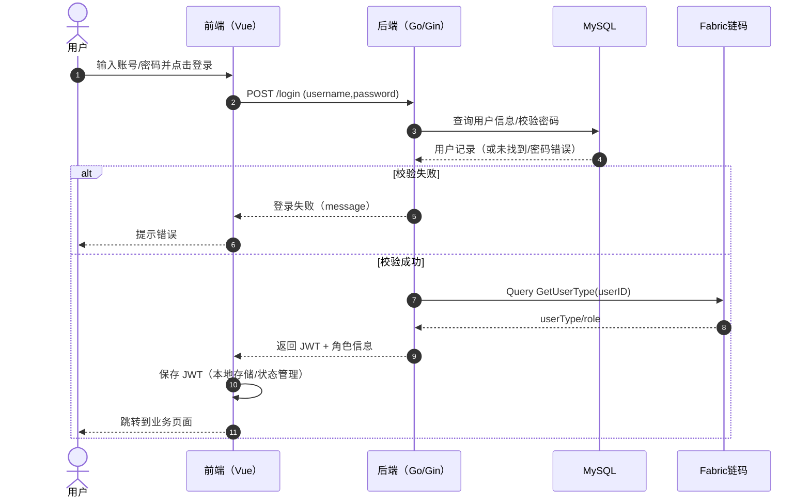
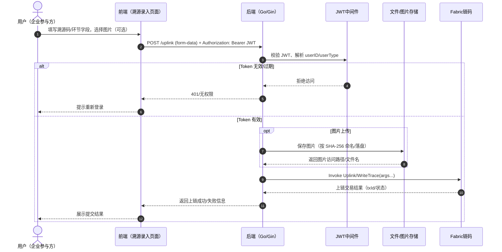
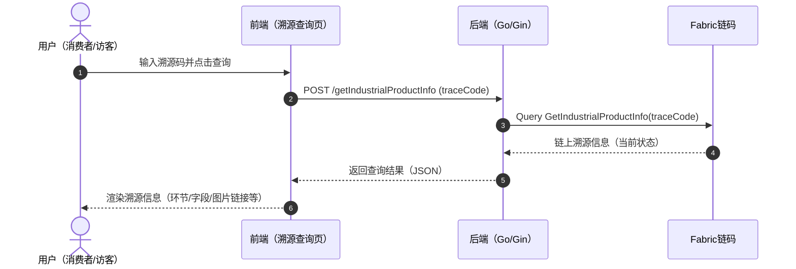
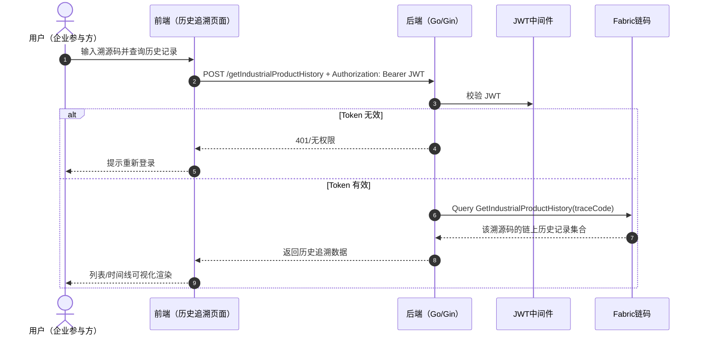
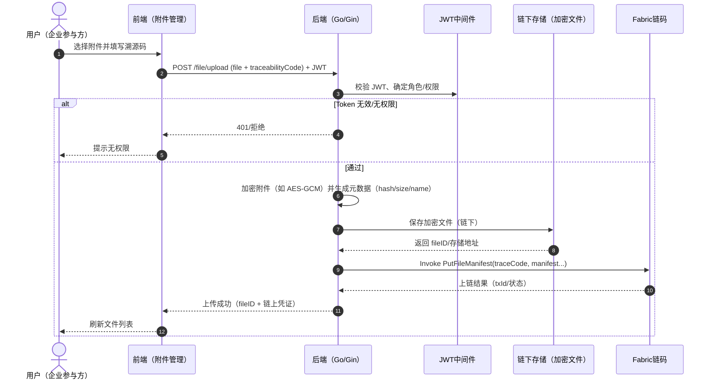
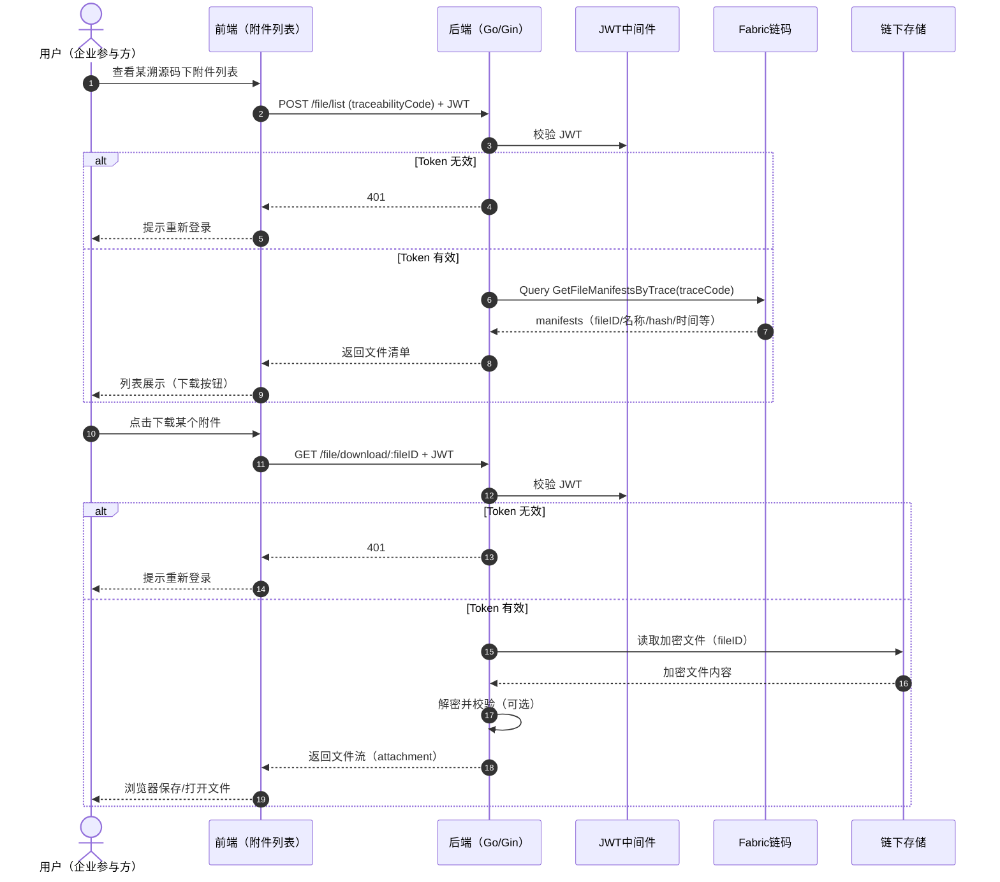

# 各部分功能实现流程泳道图（fabric-trace）

- [x] 覆盖主体：用户、前端（Web/Vue）、后端（Go/Gin）、MySQL、Fabric 链码、文件存储
- [x] 覆盖典型流程：登录鉴权、溯源上链、溯源查询（匿名/鉴权）、附件上传/下载

> 说明：以下泳道图使用 Mermaid `sequenceDiagram`（时序泳道图）表示多主体交互流程，可直接粘贴到支持 Mermaid 的 Markdown 环境中。

---

## 1) 用户登录与 JWT 鉴权流程

---

## 2) 溯源信息录入与上链流程（受 JWT 保护）

---

## 3) 溯源查询流程（匿名/消费者入口）

---

## 4) 历史追溯查询流程（受 JWT 保护）

---

## 5) 附件上传并将 Manifest 上链流程（受 JWT 保护）

---

## 6) 附件列表与下载流程（受 JWT 保护）

---

## 在你的文档中引用

如果你的 Markdown 渲染器支持 Mermaid，可以直接把本文件中的某个图复制到目标章节。

如果目标平台不支持 Mermaid：
- 可以用支持 Mermaid 的编辑器导出为 PNG/SVG 再插入；
- 或我可以在仓库里补充一个“离线导出脚本”（不依赖 sudo 的方式）。

